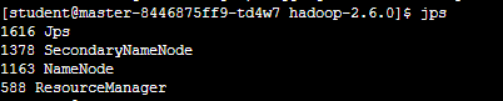
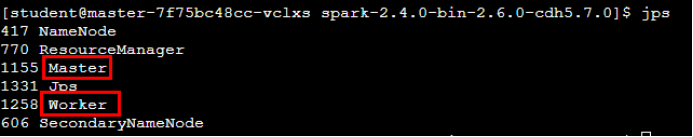
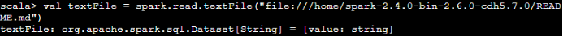
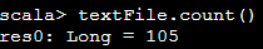
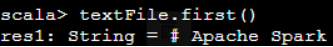

## Spark 集群环境搭建

### 实验简介

搭建Spark大数据运算环境。

### 实验目的

- 掌握常见Linux命令的使用
- 掌握Hadoop全分布式模型集群环境的搭建
- 掌握Spark集群环境的安装配置
- 掌握Spark常见开发环境的搭建及使用

### 实验内容

实验内容是搭建Spark大数据运算环境，主要包括：安装先决条件、配置SSH免密码连接、Hadoop分布式集群环境搭建、Spark集群环境安装配置，以及Spark大数据开发环境的搭建等。实验完整的展示了，Spark大数据运行环境及开发环境的搭建的整个过程，对于理解Spark的运行原理和开发流程具有指导意义。

### 实验环境

- CentOS
- JDK：1.8
- Hadoop：2.6.0
- Scala：2.11.11
- Spark：2.4
- Python：2.7.5

- 用户账号：student
- 密码：stu123

集群网络环境：

集群包含3个节点，节点之间可以免密码SSH访问，节点IP和主机分布如下：
序号IP地址主机名节点类型配置用户名密码1xxxxmasterNN/RM/SNN/Master2核/4Gstudentstu1232xxxxslave1DN/NM/Worker2核/4Gstudentstu1233xxxxslave2DN/NM/Worker2核/4Gstudentstu123
- 所有节点均是CentOS7 64bit系统，防火墙关闭，SELinux关闭，实验环境中所有节点均使用student用户。
- 所有软件均安装在/home/目录下，如：/home/hadoop。

### 实验过程

#### 修改hosts文件

实验环境的3台机器从上到下分别为master,slave1,slave2。

点进【终端连接】进入master，执行命令：

输入“i”进行修改，按【Esc】，输入“：wq“保存并退出。

依次在3台机器上使用ip addr命令获取IP地址，然后按照示例进行配置，hostname主机名： master，slave1，slave2是固定的，不需要改变。

配置示例：

依次在3台机器上修改hosts文件，步骤同上。

#### 配置免密登录

在master上执行：

此时输入yes后，要求输入master密码，从【查看详情】获取master密码，复制粘贴即可。

再执行：

此时输入yes后，输入slave1密码。

再执行：

此时输入yes后，输入slave2密码。

#### 在所有节点上安装配置JDK

本实验环境已经安装，无需额外操作。

#### 在所有节点上安装配置Scala

在master服务器上，将/home/scala-2.11.11分发到slave1和slave2:

在master服务器上编辑profile文件：

添加以下Scala环境变量：

使配置生效：

命令查看Scala的版本：

在slave1，slave2节点执行相同的profile文件的配置操作，参考上一步在master服务的操作即可。

#### 安装Hadoop集群

本实验环境已经安装，步骤可参考“Hadoop环境搭建实验”。

#### 启动Hadoop集群

在master服务器启动Hadoop，进入/home/hadoop/hadoop-2.6.0目录。

查看服务是否正常启动：

#### Spark安装部署 （在master上执行）

将/home/student下的spark-2.4.0-bin-2.6.0-cdh5.7.0.tgz 解压到/home下：

进入conf目录：

从模板创建spark-env.sh文件：

配置spark-env.sh：

在spark-env.sh文件中增加以下内容：

从模板创建slaves文件：

编辑slaves文件：

增加如下配置：

从模板创建spark-defaults.conf文件：

编辑spark-defaults.conf文件：

增加如下配置：

分发到slave1和slave2上：

依次在3台机器上配置Spark环境变量，编辑/etc/profile文件，在3台机器上都需要进行相同的操作：

添加如下内容：

使配置文件生效：

#### 启动测试集群

使用【jps】命令查看进程。可以看到如下两个进程

#### 测试 Spark中Scala的Shell

进入Spark shell for Scala：

读取本地的README.md文件，创建一个名为lines的RDD：

统计RDD中的元素个数：

返回RDD中的第一个元素，也就是README.md的第一行：

