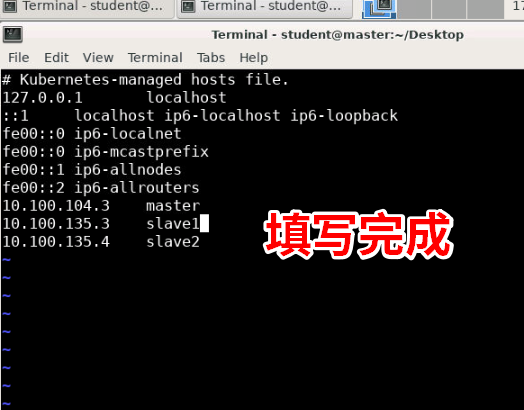
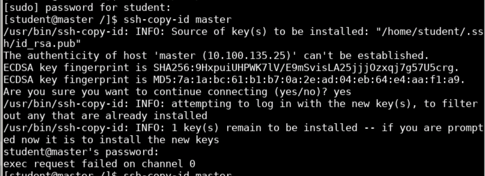
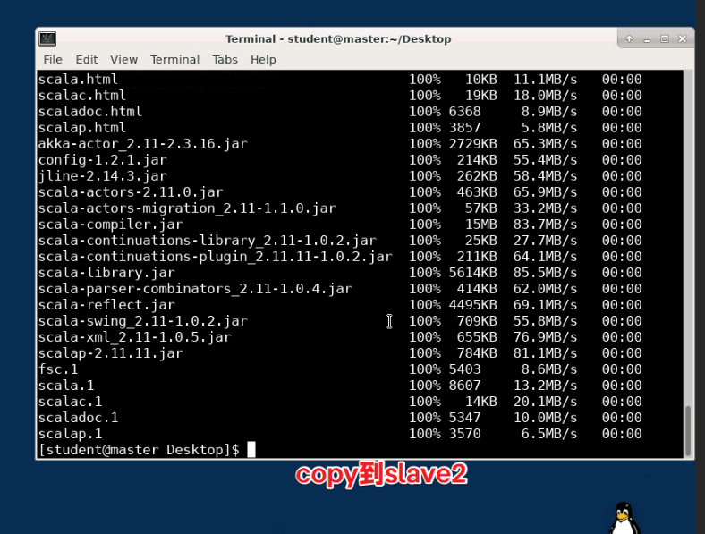
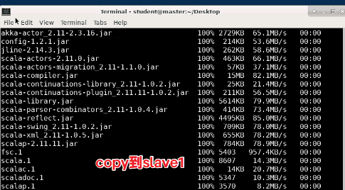
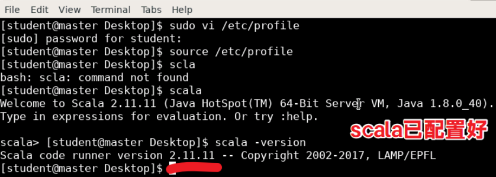
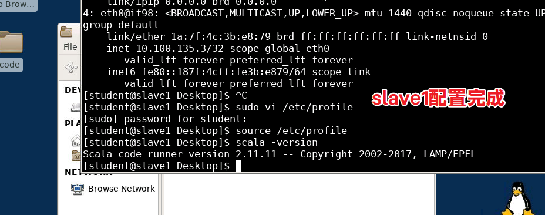
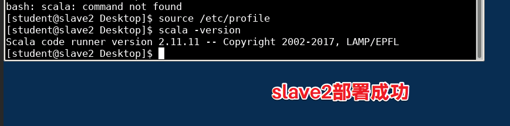
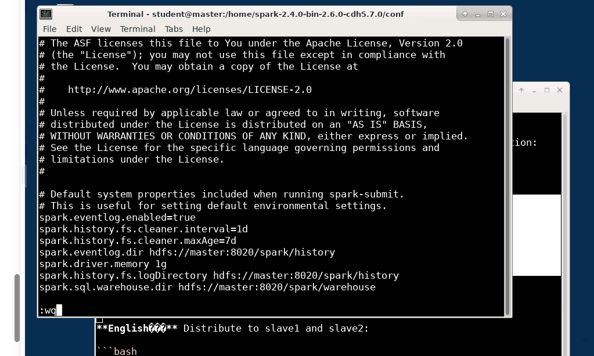
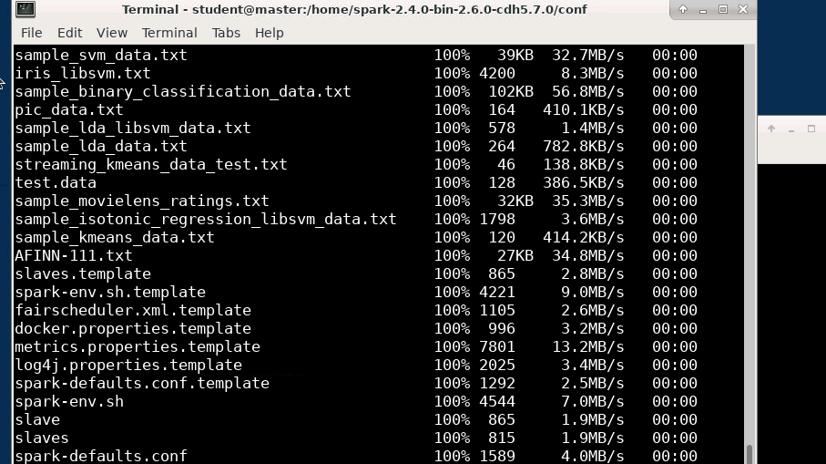
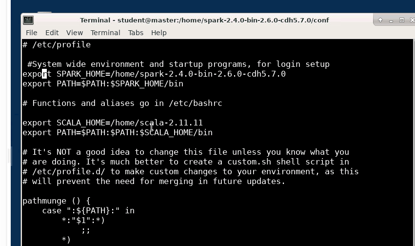

# 搭建Spark大数据运算环境 实验报告

## 一、实验目的

- 掌握常见Linux命令的使用
- 掌握Hadoop全分布式模型集群环境的搭建
- 掌握Spark集群环境的安装配置
- 掌握Spark常见开发环境的搭建及使用

## 二、实验内容

搭建Spark大数据运算环境，主要包括：安装先决条件、配置SSH免密码连接、Hadoop分布式集群环境搭建、Spark集群环境安装配置，以及Spark大数据开发环境的搭建等。

## 三、实验原理

Spark是Apache旗下的一款分布式计算框架，依赖Hadoop的HDFS进行数据存储。集群环境搭建是Spark应用的基础，需要先搭建Hadoop集群，再在此基础上部署Spark。集群采用Master-Slave架构，Master节点负责资源调度，Slave节点负责实际计算任务。

## 四、实验环境

### 4.1 集群环境

集群包含3个节点，节点之间可以免密码SSH访问：

| 序号 | IP地址 | 主机名 | 节点类型 | 配置 |
|------|--------|--------|----------|------|
| 1 | 10.100.104.3 | master | NN/RM/SNN/Master | 2核/4G |
| 2 | 10.100.135.3 | slave1 | DN/NM/Worker | 2核/4G |
| 3 | 10.100.135.4 | slave2 | DN/NM/Worker | 2核/4G |

### 4.2 软件环境

- 操作系统：CentOS 7
- JDK：1.8
- Hadoop：2.6.0
- Scala：2.11.11
- Spark：2.4
- Python：2.7.5

### 4.3 逻辑拓扑图

```
┌─────────────────────────────────────────────────────┐
│                    master                            │
│  ┌─────────┐  ┌─────────┐  ┌─────────┐             │
│  │ NameNode│  │ResourceMgr│ │SparkMaster│            │
│  └─────────┘  └─────────┘  └─────────┘             │
└─────────────────────────────────────────────────────┘
          ▲                │              │
          │  SSH免密       │              │
┌─────────┴─────────────────┴──────────────┴──────┐
│                    slave1                       │
│  ┌─────────┐  ┌─────────┐  ┌─────────┐         │
│  │DataNode │  │NodeManager│ │SparkWorker│        │
│  └─────────┘  └─────────┘  └─────────┘         │
└─────────────────────────────────────────────────┘
┌─────────────────────────────────────────────────┐
│                    slave2                       │
│  ┌─────────┐  ┌─────────┐  ┌─────────┐         │
│  │DataNode │  │NodeManager│ │SparkWorker│        │
│  └─────────┘  └─────────┘  └─────────┘         │
└─────────────────────────────────────────────────┘
```

## 五、实验过程

### 5.1 修改hosts文件

在所有节点上修改/etc/hosts文件，添加集群各节点的IP和主机名映射。



执行命令：
```
sudo vi /etc/hosts
```

添加内容：
```
10.100.104.3    master
10.100.135.3    slave1
10.100.135.4    slave2
```

### 5.2 配置SSH免密码登录

在master节点上生成SSH密钥对，并将公钥分发到各节点，实现master到slave1、slave2的免密码登录。



执行命令：
```bash
ssh-keygen -t rsa
ssh-copy-id master
ssh-copy-id slave1
ssh-copy-id slave2
```

### 5.3 安装配置Scala

在master服务器上解压Scala安装包，分发到slave节点，并在所有节点配置环境变量。

执行以下命令进行配置：

```bash
# 解压Scala
tar -xzf scala-2.11.11.tgz

# 分发到slave1和slave2
scp -r /home/scala-2.11.11 slave1:/home/
scp -r /home/scala-2.11.11 slave2:/home/

# 配置环境变量(/etc/profile)
export SCALA_HOME=/home/scala-2.11.11
export PATH=$PATH:$SCALA_HOME/bin

# 使配置生效
source /etc/profile

# 验证安装
scala -version
```







在slave1和slave2节点执行相同的配置操作。





### 5.4 启动Hadoop集群

在master节点启动Hadoop集群，并验证各服务是否正常启动。

执行命令：

```bash
cd /home/hadoop/hadoop-2.6.0
./sbin/start-dfs.sh
./sbin/start-yarn.sh
jps
```


可以看到ResourceManager和Jps进程正在运行。

### 5.5 Spark安装部署

#### 5.5.1 解压Spark安装包

在master节点解压Spark安装包到/home目录下：

```bash
tar -xzf spark-2.4.0-bin-2.6.0-cdh5.7.0.tgz -C /home
```

#### 5.5.2 配置spark-env.sh

进入conf目录，从模板创建并编辑spark-env.sh：

```bash
cd /home/spark-2.4.0-bin-2.6.0-cdh5.7.0/conf
cp spark-env.sh.template spark-env.sh
vi spark-env.sh
```

添加配置：
```bash
export SPARK_HOME=/home/spark-2.4.0-bin-2.6.0-cdh5.7.0
export SCALA_HOME=/home/scala-2.11.11
export JAVA_HOME=/usr/java/jdk1.8.0
export HADOOP_HOME=/home/hadoop/hadoop-2.6.0
export HADOOP_CONF_DIR=/home/hadoop/hadoop-2.6.0/etc/hadoop
export SPARK_MASTER_IP=master
export SPARK_WORKER_MEMORY=1g
export SPARK_WORKER_CORES=2
```

#### 5.5.3 配置slaves文件

编辑slaves文件，指定Worker节点：

```bash
vi slaves
```

添加内容：
```
slave1
slave2
```



#### 5.5.4 配置spark-defaults.conf

```bash
cp spark-defaults.conf.template spark-defaults.conf
vi spark-defaults.conf
```

添加配置：
```bash
spark.eventlog.enabled           true
spark.eventlog.dir                hdfs://master:8020/spark/history
spark.history.fs.logDirectory     hdfs://master:8020/spark/history
spark.driver.memory               1g
spark.sql.warehouse.dir           hdfs://master:8020/spark/warehouse
```

#### 5.5.5 分发到slave节点

将配置好的Spark目录分发到slave1和slave2：

```bash
scp -r /home/spark-2.4.0-bin-2.6.0-cdh5.7.0 slave1:/home/
scp -r /home/spark-2.4.0-bin-2.6.0-cdh5.7.0 slave2:/home/
```



#### 5.5.6 配置环境变量

在所有三台机器上编辑/etc/profile，添加Spark和Scala的环境变量：

```bash
sudo vi /etc/profile
```

添加内容：
```bash
export SPARK_HOME=/home/spark-2.4.0-bin-2.6.0-cdh5.7.0
export PATH=$PATH:$SPARK_HOME/bin:$SPARK_HOME/sbin
export SCALA_HOME=/home/scala-2.11.11
export PATH=$PATH:$SCALA_HOME/bin
```

使配置生效：
```bash
source /etc/profile
```



### 5.6 启动测试集群

在master节点启动Spark集群：

```bash
cd /home/spark-2.4.0-bin-2.6.0-cdh5.7.0
./sbin/start-all.sh
```

使用jps命令查看进程，确认Master和Worker进程已启动。

## 六、实验结果

### 6.1 Spark集群启动验证

执行jps命令后，可以看到以下进程正常运行：
- Master进程
- Worker进程

### 6.2 Spark Shell测试

进入Spark Shell for Scala，测试RDD操作：

```bash
spark-shell
```

读取README.md文件并创建Dataset：

```scala
val textFile = spark.read.textFile("file:///home/spark-2.4.0-bin-2.6.0-cdh5.7.0/README.md")
```

统计元素个数：

```scala
textFile.count
```

返回结果显示为105，表示README.md共有105行。

返回第一个元素：

```scala
textFile.first
```

返回结果为"# Apache Spark"，即README.md文件的第一行内容。

## 七、实验总结

本次实验完成了Spark集群环境的搭建，主要收获如下：

1. 掌握了Linux下分布式集群环境搭建的基本流程，包括网络配置、SSH免密登录、环境变量配置等。

2. 理解了Spark基于Hadoop的架构设计，Spark依赖Hadoop的HDFS进行数据存储，需要先启动Hadoop集群再启动Spark。

3. 熟悉了Spark的核心配置文件作用：spark-env.sh配置运行环境参数，slaves文件指定Worker节点，spark-defaults.conf配置应用程序默认值。

4. 实践了Spark集群的分发部署机制，配置文件需要在所有节点保持一致，环境变量的配置也需要在所有节点完成。

5. 通过Spark Shell初步了解了RDD的创建和基本操作，为后续的RDD编程打下基础。