# 实验10 Spark MLlib 应用：构建回归模型

## 一、实验目的

1. 掌握线性回归的基本概念和原理；
2. 掌握使用Spark MLlib构建回归模型。

## 二、实验内容

本实验给出了如何导入训练集数据，将其解析为带标签点的RDD，然后使用LinearRegressionWithSGD（基于随机梯度下降模型的线性回归）算法来建立一个简单的线性模型来预测标签的值，最后计算了均方差（Mean Squared Error）来评估预测值与实际值的吻合度。

## 三、实验原理

### 3.1 线性回归概述

线性回归是一种经典的监督学习算法，用于预测连续型目标变量。其核心思想是找到一个线性函数来拟合输入特征和输出标签之间的关系。

### 3.2 线性回归模型

线性回归模型可以表示为：

$$y = \theta^T \cdot x + b$$

其中：
- $y$ 是预测值（标签）
- $x$ 是输入特征向量
- $\theta$ 是特征权重向量
- $b$ 是偏置项

### 3.3 随机梯度下降（SGD）

随机梯度下降是一种优化算法，用于在每次迭代中逐步调整模型参数以最小化损失函数。在Spark MLlib中，`LinearRegressionWithSGD`使用SGD来优化线性回归模型的参数。

### 3.4 逻辑拓扑图

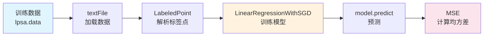

### 3.5 均方差（MSE）

均方差是评估回归模型性能的常用指标，计算公式为：

$$MSE = \frac{1}{n}\sum_{i=1}^{n}(y_i - \hat{y}_i)^2$$

其中 $y_i$ 是实际值，$\hat{y}_i$ 是预测值。

## 四、实验环境

### 4.1 软件环境

| 环境 | 版本 |
|------|------|
| Hadoop | 2.6分布式集群环境 |
| Spark | 2.3 |
| CentOS | 7 |
| 开发工具 | IntelliJ IDEA |

### 4.2 用户账号

- 账号：`student`
- 密码：`stu123`

### 4.3 项目依赖

```xml
<dependencies>
    <dependency>
        <groupId>org.apache.spark</groupId>
        <artifactId>spark-core_2.11</artifactId>
        <version>2.3.3</version>
    </dependency>
    <dependency>
        <groupId>org.apache.spark</groupId>
        <artifactId>spark-mllib_2.11</artifactId>
        <version>2.3.3</version>
    </dependency>
</dependencies>
```

### 4.4 实验环境截图

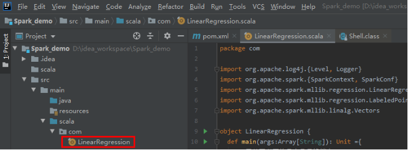

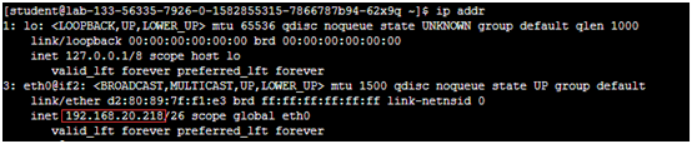

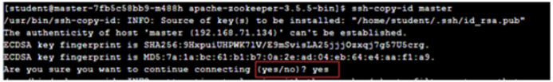


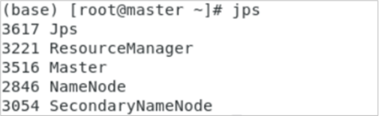

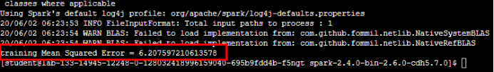

## 五、实验过程

### 5.1 环境准备

#### 步骤1：修改hosts文件

```bash
sudo vi /etc/hosts
```

#### 步骤2：配置免密连接

```bash
ssh-keygen -t rsa
ssh-copy-id student@master
```

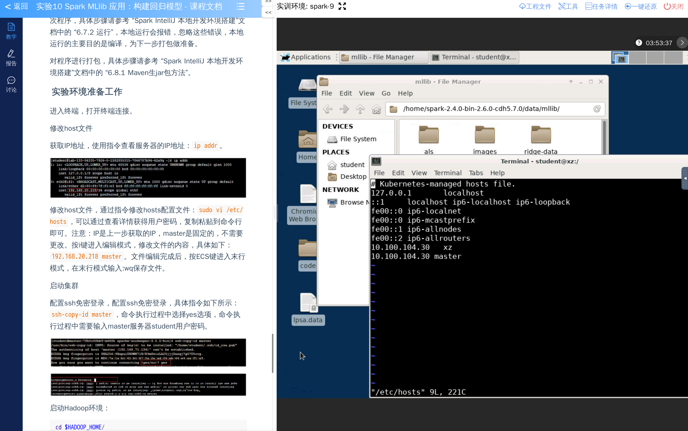

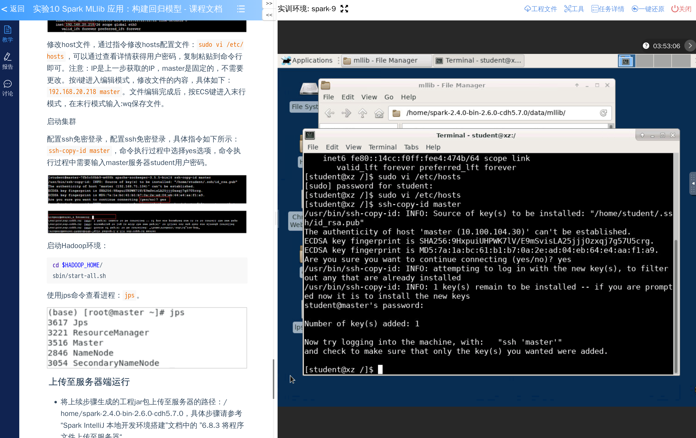

### 5.2 启动Hadoop集群

#### 步骤3：启动全部进程

```bash
cd $HADOOP_HOME/
sbin/start-all.sh
```

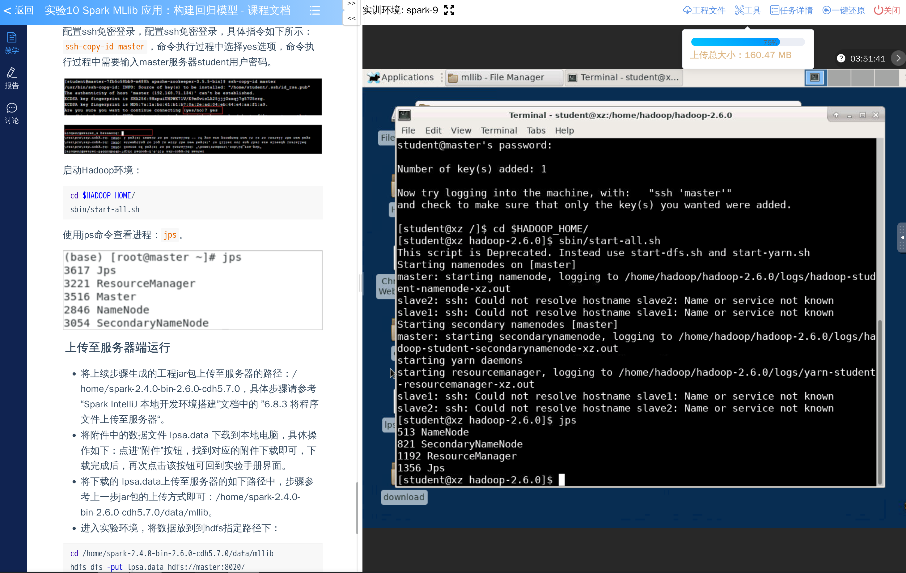

### 5.3 数据准备

#### 步骤4：上传数据文件

```bash
cd /home/spark-2.4.0-bin-2.6.0-cdh5.7.0/data/mllib
hdfs dfs -put lpsa.data hdfs://master:8020/
```

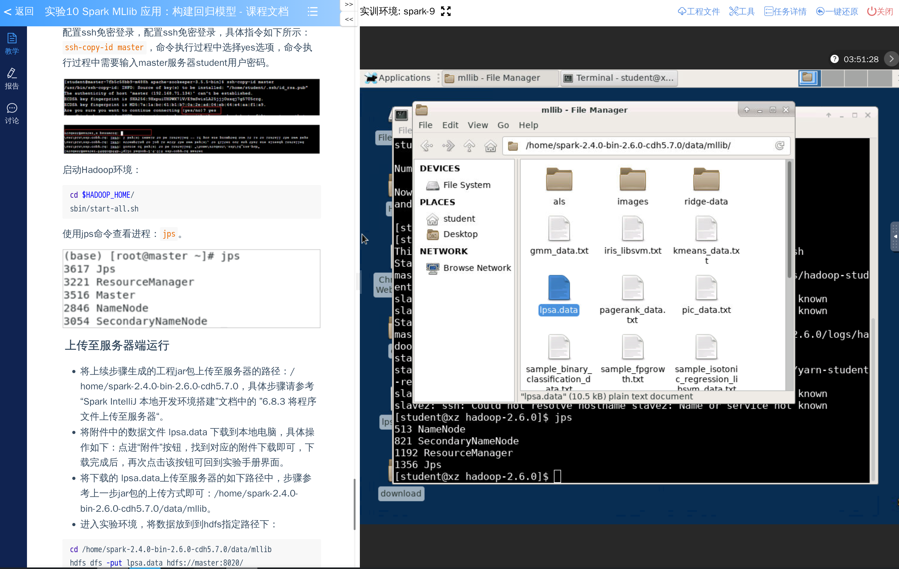

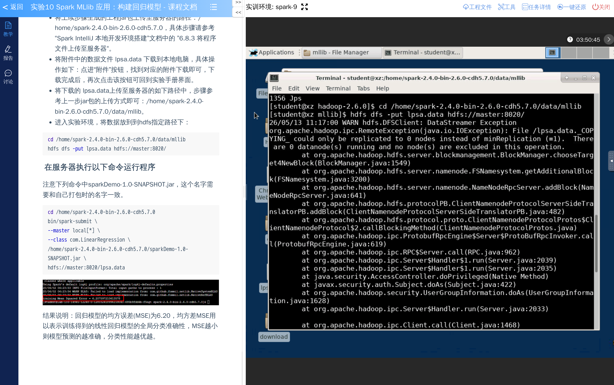

### 5.4 程序实现

#### 步骤5：创建线性回归程序

```scala
package com

import org.apache.log4j.{Level, Logger}
import org.apache.spark.{SparkContext, SparkConf}
import org.apache.spark.mllib.regression.LinearRegressionWithSGD
import org.apache.spark.mllib.regression.LabeledPoint
import org.apache.spark.mllib.linalg.Vectors

object LinearRegression {
  def main(args: Array[String]): Unit = {
    // 屏蔽不必要的日志显示终端上
    Logger.getLogger("org.apache.spark").setLevel(Level.ERROR)
    Logger.getLogger("org.eclipse.jetty.server").setLevel(Level.OFF)
    
    // 设置运行环境
    val conf = new SparkConf().setAppName("LinearRegression").setMaster("local[*]")
    val sc = new SparkContext(conf)
    
    // 加载数据
    val data = sc.textFile(args(0))
    val parsedData = data.map { line =>
      // 按照分隔符split解析数据，将数据分行两个元素
      val parts = line.split(",")
      // 创建标签为的稀疏向量标注点
      LabeledPoint(parts(0).toDouble, Vectors.dense(parts(1).split(" ").map(_.toDouble)))
    }
    
    // 设置迭代次数
    val numIterations = 100
    
    // 建立线性回归模型并训练
    val model = LinearRegressionWithSGD.train(parsedData, numIterations)
    
    // 预测数据格式化
    val valuesAndPreds = parsedData.map { point =>
      // 使用模型预测数据
      val prediction = model.predict(point.features)
      (point.label, prediction)
    }
    
    // 计算均方差
    val MSE = valuesAndPreds.map { case (v, p) => math.pow((v - p), 2) }.reduce(_ + _) / valuesAndPreds.count
    
    // 打印预测数据
    println("training Mean Squared Error = " + MSE)
    
    sc.stop()
  }
}
```

### 5.5 运行程序

#### 步骤6：执行spark-submit

```bash
cd /home/spark-2.4.0-bin-2.6.0-cdh5.7.0

bin/spark-submit \
--master local[*] \
--class com.LinearRegression \
/home/spark-2.4.0-bin-2.6.0-cdh5.7.0/sparkDemo-1.0-SNAPSHOT.jar \
file:///home/spark-2.4.0-bin-2.6.0-cdh5.7.0/data/mllib/lpsa.data
```

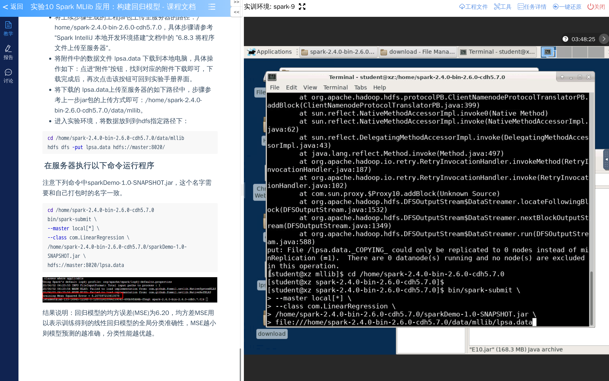

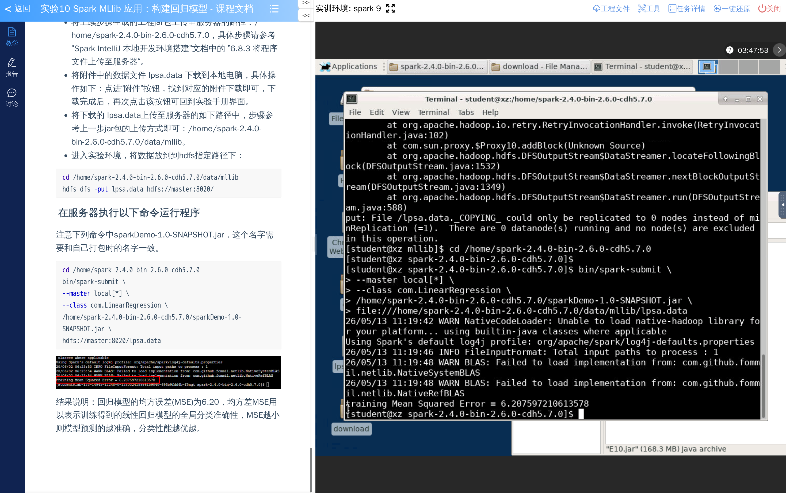

## 六、实验结果

### 6.1 结果展示

程序运行后，会输出训练数据的均方差（Mean Squared Error），用于评估模型的预测性能。

### 6.2 结果分析

1. **数据解析**：将原始数据文件解析为LabeledPoint格式，其中第一列是标签（目标值），第二列是以空格分隔的特征向量。

2. **模型训练**：使用LinearRegressionWithSGD算法，设置100次迭代来训练线性回归模型。

3. **预测评估**：通过计算均方差来评估模型性能，MSE越小表示预测值与实际值越接近。

### 6.3 关键结果截图


## 七、实验总结

### 7.1 收获与体会

通过本次实验，我掌握了以下技能和知识：

1. **线性回归原理**：
   - 理解了线性回归模型的基本概念和数学表达
   - 理解了如何使用梯度下降算法优化模型参数

2. **Spark MLlib回归模型**：
   - 学会了使用`LinearRegressionWithSGD`构建线性回归模型
   - 掌握了LabeledPoint数据格式的使用方法
   - 学会了使用model.predict进行预测

3. **模型评估**：
   - 理解了均方差（MSE）作为回归评估指标的含义
   - 学会了计算和解释MSE结果

4. **Spark编程模式**：
   - 掌握了SparkContext的创建和配置
   - 学会了RDD的数据处理和转换操作

### 7.2 注意事项

1. 在运行Spark程序前，需要确保Hadoop集群已正常启动。

2. 数据文件路径可以使用本地路径（file://）或HDFS路径（hdfs://），根据实际部署环境选择。

3. 迭代次数的设置需要根据数据规模和收敛情况调整，100次迭代是常用的默认值。

4. 均方差（MSE）的值越小表示模型预测越准确，但需要注意过拟合的风险。

5. 在实际应用中，可能需要对数据进行归一化或标准化处理以提高模型性能。