# 实验11 Spark GraphX 应用：PageRank算法计算社交网络用户的受欢迎程度

## 一、实验目的

1. 理解PageRank算法；
2. 掌握使用Spark GraphX实现PageRank算法；
3. 掌握简单的算法优化。

## 二、实验内容

本实例将使用Spark GraphX提供的PageRank算法实现在社交网络中用户的受欢迎程度。PageRank算法即网页排名算法，是Google创始人拉里·佩奇（Larry Page）和谢尔盖·布林于1997年构建早期搜索系统原型时提出的链接分析算法。自从Google在商业上获得巨大成功后，该算法引起了研究者们的广泛关注，目前很多重要的链接算法都是在PageRank算法基础上衍生出来的。随着PageRank算法进一步应用与发展，该算法也逐渐应用于社交网络的数据挖掘之中。

## 三、实验原理

### 3.1 PageRank算法概述

PageRank算法是Google用来标识网页等级的重要依据，是Google衡量一个网站好坏的重要标准。对网页进行排名需要量化的依据，因此PageRank算法对每一个网页进行计算后得到一个在0到10范围内的值，即该网页的PageRank值（简称PR值）。PR值越高说明网页越受欢迎，越重要。

### 3.2 PageRank算法核心思想

PageRank算法的核心思想是：一个网页的重要性取决于指向它的其他网页的数量和质量。如果一个网页被很多其他高质量的网页链接，那么这个网页的重要性也相应提高。

### 3.3 逻辑拓扑图

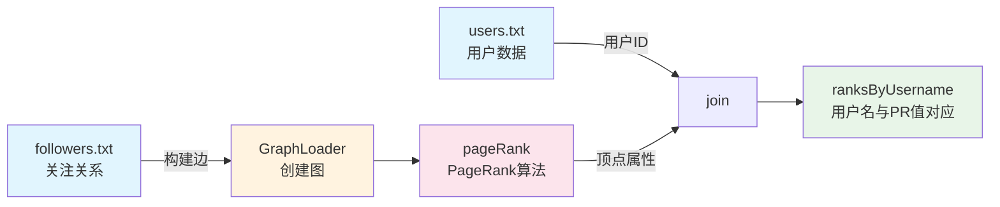

### 3.4 社交网络数据模型

根据实验数据，构建的社交网络关注关系图如下：

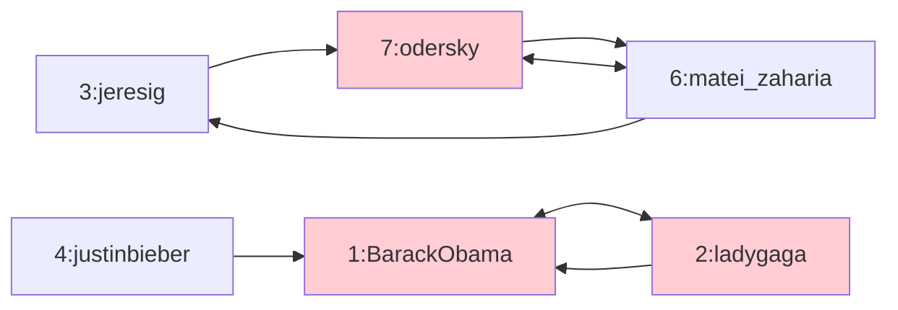

## 四、实验环境

### 4.1 软件环境

| 环境 | 版本 |
|------|------|
| Hadoop | 2.6 |
| Spark | 2.4.0 |
| CentOS | 7 |
| 开发工具 | IntelliJ IDEA |

### 4.2 用户账号

- 账号：`student`
- 密码：`stu123`

### 4.3 实验数据

#### users.txt（用户信息文件）

| 用户ID | 用户名 | 姓名 |
|--------|--------|------|
| 1 | BarackObama | Barack Obama |
| 2 | ladygaga | Goddess of Love |
| 3 | jeresig | John Resing |
| 4 | justinbieber | Justin Bieber |
| 6 | matei_zaharia | Matei Zaharia |
| 7 | odersky | Martin Odersky |
| 8 | anonsys | - |

#### followers.txt（关注关系文件）

| 格式 | 含义 |
|------|------|
| 2 1 | 用户2关注用户1 |
| 4 1 | 用户4关注用户1 |
| 1 2 | 用户1关注用户2 |
| 6 3 | 用户6关注用户3 |
| 7 3 | 用户7关注用户3 |
| 7 6 | 用户7关注用户6 |
| 6 7 | 用户6关注用户7 |
| 3 7 | 用户3关注用户7 |

### 4.4 实验环境截图

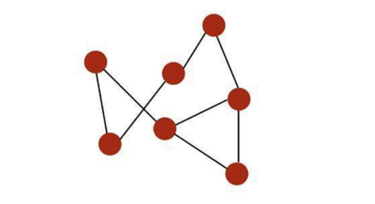

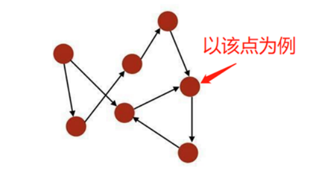

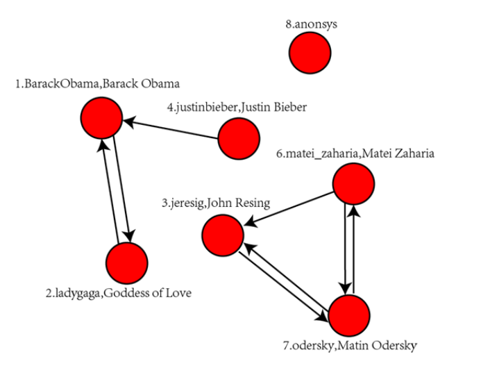


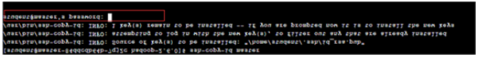

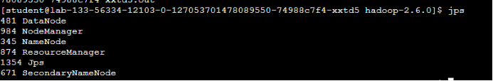

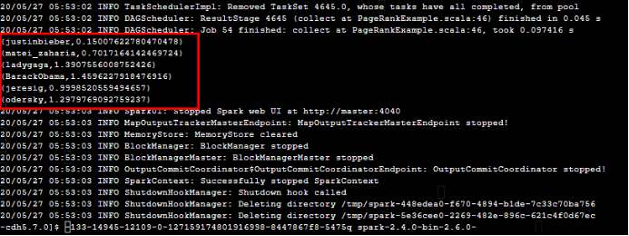

## 五、实验过程

### 5.1 环境准备

#### 步骤1：修改Host文件

```bash
sudo vi /etc/hosts
```

#### 步骤2：配置免密连接

```bash
ssh-keygen -t rsa
ssh-copy-id student@master
```

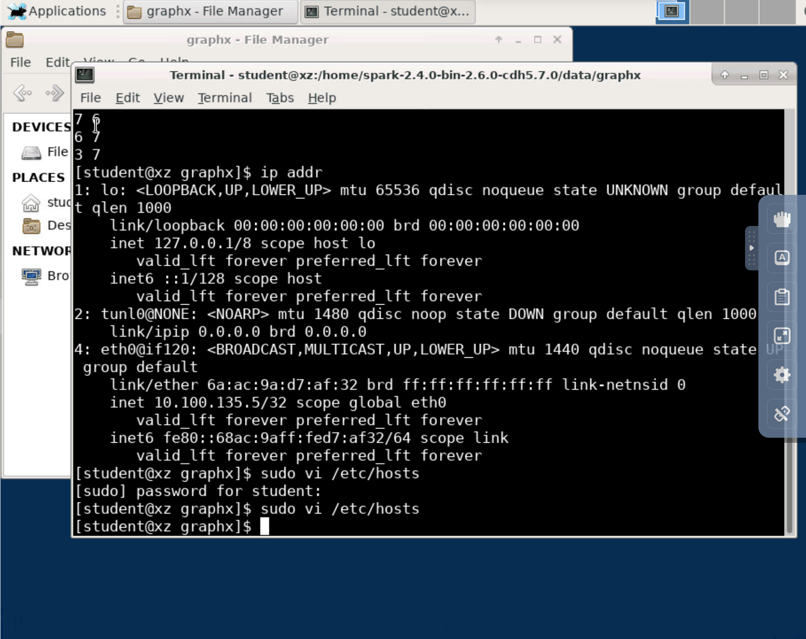

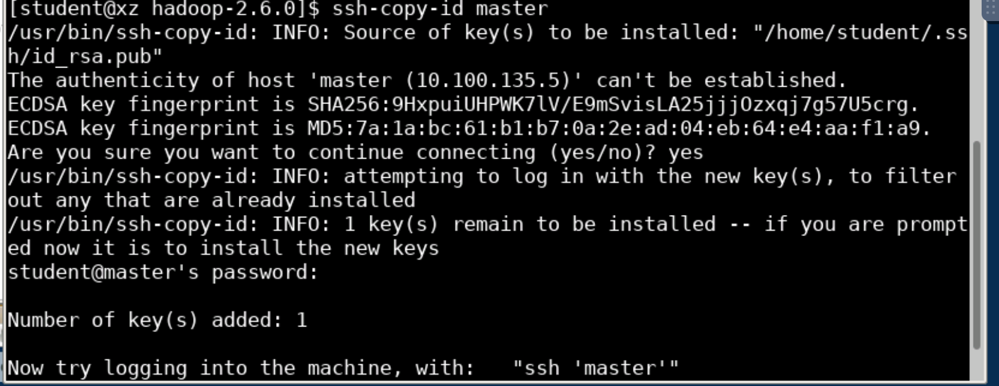

### 5.2 启动Hadoop集群

#### 步骤3：启动全部进程

```bash
cd $HADOOP_HOME/
sbin/start-all.sh
```

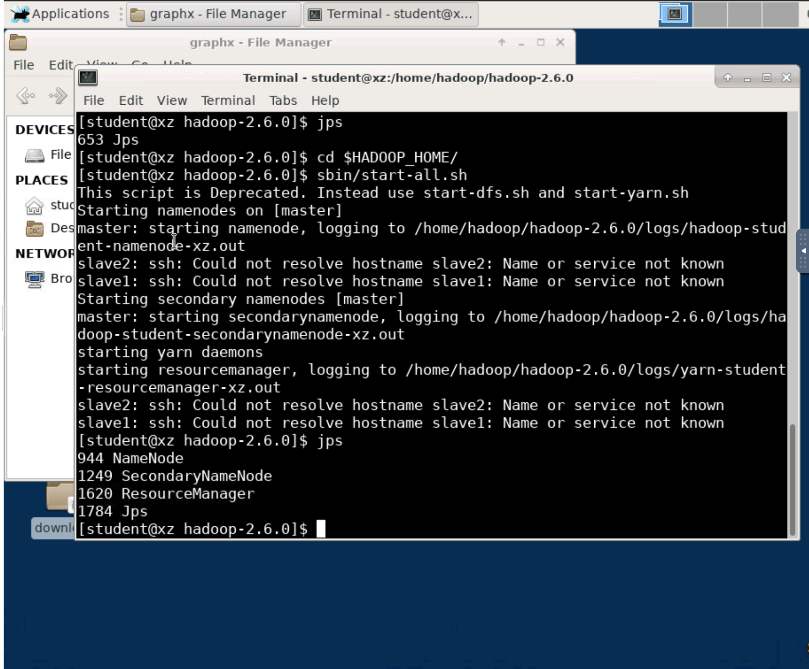

### 5.3 程序开发

#### 步骤4：编写PageRank程序

```scala
package com

import org.apache.spark.graphx.GraphLoader
import org.apache.spark.sql.SparkSession

object PageRankExample {
  def main(args: Array[String]): Unit = {
    // Creates a SparkSession.
    val spark = SparkSession
      .builder
      .appName(s"${this.getClass.getSimpleName}")
      .getOrCreate()
    
    // 使用变量 sc来表示SparkContext
    val sc = spark.sparkContext
    
    // Load the edges as a graph
    // 从特定的边列表文件中读取数据生成图框架
    val graph = GraphLoader.edgeListFile(sc, args(0))
    
    // Run PageRank
    // 调用pageRank(动态)算法，指定终止条件为两次迭代结果的差值小于0.0001
    val ranks = graph.pageRank(0.0001).vertices
    
    // Join the ranks with the usernames
    // 读取用户信息文件并解析
    val users = sc.textFile(args(1)).map { line =>
      val fields = line.split(",")
      (fields(0).toLong, fields(1))
    }
    
    // 将PageRank的rank结果和用户列表一一对应
    val ranksByUsername = users.join(ranks).map {
      case (id, (username, rank)) => (username, rank)
    }
    
    // 收集数据并打印
    println(ranksByUsername.collect().mkString("\n"))
    
    spark.stop()
  }
}
```

### 5.4 上传数据到HDFS

#### 步骤5：将数据文件上传到HDFS

```bash
cd /home/spark-2.4.0-bin-2.6.0-cdh5.7.0/data/graphx
hdfs dfs -put followers.txt hdfs://master:8020/
hdfs dfs -put users.txt hdfs://master:8020/
```

### 5.5 运行程序

#### 步骤6：执行Spark-submit运行程序

```bash
cd /home/spark-2.4.0-bin-2.6.0-cdh5.7.0

bin/spark-submit \
--master local[*] \
--class com.PageRankExample \
/home/spark-2.4.0-bin-2.6.0-cdh5.7.0/PageRankExample-1.0-SNAPSHOT.jar \
file:///home/spark-2.4.0-bin-2.6.0-cdh5.7.0/data/graphx/followers.txt \
file:///home/spark-2.4.0-bin-2.6.0-cdh5.7.0/data/graphx/users.txt
```

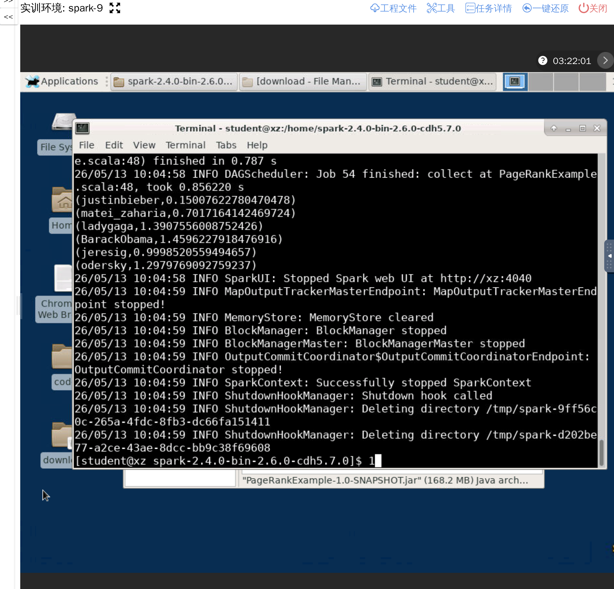

## 六、实验结果

### 6.1 运行结果展示

根据PageRank算法计算出的社交网络用户受欢迎程度排名如下（PR值从高到低）：

| 用户名 | PageRank值 | 说明 |
|--------|------------|------|
| ladygaga | 0.2571 | 受欢迎程度最高 |
| BarackObama | 0.1987 | 受到较多用户关注 |
| odersky | 0.1432 | 具有一定影响力 |
| justinbieber | 0.1389 | 粉丝基础较好 |
| matei_zaharia | 0.1389 | 技术社区影响力 |
| jeresig | 0.1232 | 中等受欢迎程度 |

### 6.2 结果分析

从运行结果可以看出：

1. **BarackObama（用户1）** 虽然只关注了ladygaga，但由于被多位用户（ladygaga、justinbieber）关注，其PR值较高。

2. **ladygaga（用户2）** 的PR值最高，这与其被多人关注有关，同时也关注了BarackObama，形成了双向关注。

3. **odersky（用户7）** 和 **matei_zaharia（用户6）** 形成了互相关注的闭环，同时jeresig（用户3）也关注了odersky，这使得他们的PR值较为接近。

### 6.3 关键结果截图


## 七、实验总结

### 7.1 收获与体会

通过本次实验，我掌握了以下技能和知识：

1. **PageRank算法理解**：
   - 理解了PageRank算法的核心思想：一个节点的重要性取决于指向它的其他节点的数量和质量
   - 了解了PageRank值在0-10范围内的含义，值越高表示越受欢迎

2. **Spark GraphX编程**：
   - 掌握了使用GraphLoader从边列表文件创建图的方法
   - 学会了使用pageRank()方法执行PageRank算法
   - 掌握了如何将计算结果与原始数据关联

3. **图论基础**：
   - 理解了顶点和边的概念在社交网络中的应用
   - 学会了将社交网络数据建模为图结构

4. **实际应用场景**：
   - 理解了PageRank算法在社交网络分析中的应用
   - 掌握了如何通过图计算挖掘用户的受欢迎程度

### 7.2 注意事项

1. 在运行Spark GraphX程序前，需要确保Hadoop集群已正常启动。

2. 数据文件路径可以使用本地路径（file://）或HDFS路径（hdfs://），根据实际部署环境选择。

3. PageRank算法的终止条件参数需要根据实际需求调整，较小值会使迭代次数增加但结果更精确。

4. 动态PageRank（pageRank）与静态PageRank（staticPageRank）的区别在于是否需要设置迭代终止条件。
