## Spark RDD 编程基础

### 实验简介

实验内容是掌握Spark RDD如何加载数据源，并对数据进行的一系列操作（转化、行动），将分析处理后的结果进行存储。最终将综合运用所学知识完成一个WordCount实例。

### 实验目的

- 掌握Spark RDD的数据源；
- 掌握Spark RDD的常见转化操作；
- 掌握Spark RDD的常见行动操作；
- 掌握Spark RDD的WordCount实例。

### 实验内容

实验内容是掌握Spark RDD如何加载数据源，并对数据进行的一系列操作（转化、行动），将分析处理后的结果进行存储。最终将综合运用所学知识完成一个WordCount实例。

### 实验知识点

- Spark RDD数据源
- Spark RDD的转化操作
- Spark RDD的行动操作

### 实验环境

- 软件环境：

Hadoop 2.7分布式集群环境

Spark 2

- 开发环境、工具：

CentOS 7

SparkSQL Shell‘

- 用户账号

账号：student

密码：stu123

### 实验过程

#### 准备工作

- 进入终端，打开终端连接。
- 启动Spark集群，启动Spark指令如下：

#### Spark RDD数据源

Spark的数据源有两种，一种是内部数据源通过SparkContext的parallelize()方法将数据并行话生成RDD，另外一种是从外部存储中读取数据集生成RDD（如文件系统、HDFS、HBase等）。

首先我们在Linux中执行以下命令“spark-shell”进入Spark命令行。

- 内部数据源

内部数据源通常是先创建一个列表，然后调用SparkContext的parallelize()方法将集合转换为RDD进行后续操作。

在spark-shell中输入如下代码：

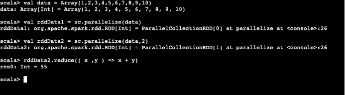

- 外部数据源

在实际开发中我们最常使用的就是从外部读取数据创建RDD。Spark支持从任何Hadoop支持的存储上创建RDD，如本地文件系统、HDFS、HBase等。

在spark-shell中输入如下代码：

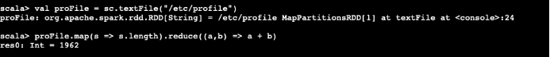

#### Spark RDD转化操作（Transformation）

Spark中的转化操作都是惰性求值，只有执行行动（Action）操作是才会被真正计算。Spark只是在内部记录下一系列的转化操作，再遇到行动（Action）操作时才计算之前的行动操作。Spark这样做会极大的优化程序执行的效率。下面我们依次使用Spark RDD的常用转化操作来学习他们。

map()

map应用于RDD中的每一个元素，返回一个新的RDD，具体指令如下：

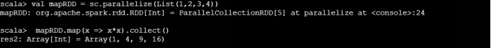

flatMap()

flatMap()把RDD中的每个元素生成多个输出元素，将元素数据数据进行拆分，具体指令如下：

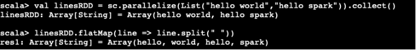

filter()

使用函数过滤掉不符合条件的元素，具体指令如下：

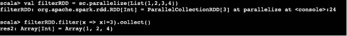

distinct()

把RDD中重复的元素去除，具体指令如下：

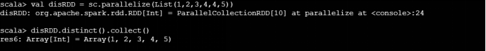

union()

合并两个RDD的所有元素，具体指令如下：

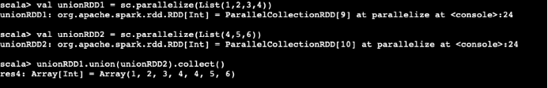

intersection()

生成包含两个RDD共同元素的RDD，也可以成为交集运算，具体指令如下：

 

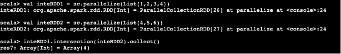

subtract()

将原RDD和参与运算的RDD中相同的元素去除，也可以成为差集运算，具体指令如下：

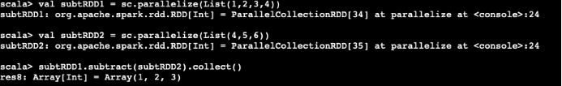

#### Spark 行动操作（Action）

上面我们说了RDD的操作分为转化（Transformation）操作和行动（Action）操作。转化操作就是从一个 RDD 产生一个新的 RDD并且是惰性的，而行动操作就是进行实际的计算。下面我们依次使用Spark RDD的常用行动操作来学习他们。

collect()

输出RDD中的所有元素，具体指令如下：

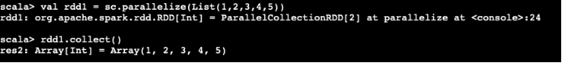

count()

计算RDD的长度，或者说时RDD中元素的个数，具体指令如下：

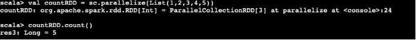

countByValue()

计算RDD中每个元素出现的次数，具体指令如下：

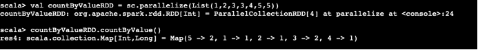

take(num)

从RDD中输出num个元素，具体指令如下：

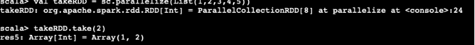

top(num)

从RDD中按照默认（降序）或者指定的排序输出最前面的num个元素，具体指令如下：

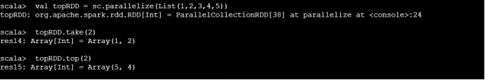

reduce(func)

并行整合RDD中所有数据。reduce将RDD中元素两两传递给输入函数求得一个新值，再把新值与RDD中的下一个值一起传递给输入函数直到最后一个值为止。具体指令如下：

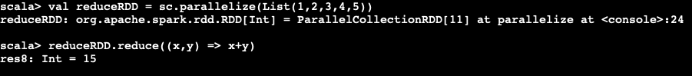

foreach(func)

对RDD中每个元素使用给定的操作，具体指令如下：

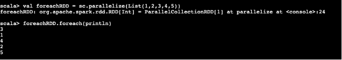

#### Spark RDD 实例：WordCount

通过以上的基础操作，我们可以大致的了解了RDD的转化和行动操作，现在我们操作一个例子来感受RDD在实际中的运用。

实例结合了RDD的数据源、转化、行动操作，在spark-shell中运行如下的命令，来统计本地文件/etc/profile中单词的出现次数：

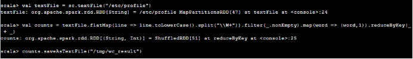

使用命令退出Spark-shell，具体指令如下：

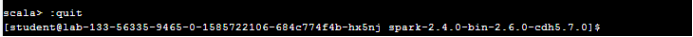

进入/tmp/wc_result/目录，具体指令如下：

使用ls指令可以看到该目录下有3个文件，具体指令如下：

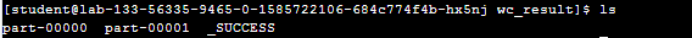

查看part-00000文件内容，具体指令如下：

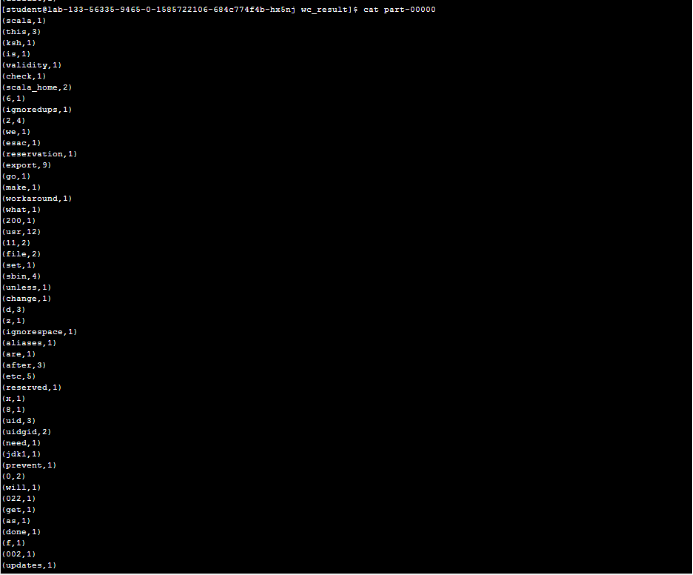

代码步骤说明：

第一步 使用 SparkContext 的 textFile() 函数从本地文件系统读取 /etc/profile 文件将其转化为RDD。

第二步 使用 flatMap(line => line.toLowerCase().split("\W+")) 把每一行中的句子分隔开，将其转化为记录着每一个单词的RDD。

第三步 使用 filter(_.nonEmpty) 过滤掉元素中的空值。

第四步 使用 map(word => (word,1)) 把记录着每一个单词的 RDD 转化为 (word,1) 这种表示每一个单词出现一次的键值对形式的 RDD。

第五步 使用 reduceByKey(_ + _) 把具有相同键的 RDD 的次数进行相加，求出每个单词的词频。

第六步 使用 saveAsTextFile("/tmp/wc_result") 函数把结果存入 /tmp/wc_resule 文件夹中。