# Spark RDD 编程基础 实验报告

## 一、实验简介

本实验旨在掌握Spark RDD如何加载数据源，并对数据进行的一系列操作（转化、行动），将分析处理后的结果进行存储。最终综合运用所学知识完成一个WordCount实例。

## 二、实验目的

- 掌握Spark RDD的数据源
- 掌握Spark RDD的常见转化操作
- 掌握Spark RDD的常见行动操作
- 掌握Spark RDD的WordCount实例

## 三、实验原理

### 3.1 Spark概述

Apache Spark是一个开源的分布式计算框架，专为大规模数据处理而设计。Spark的核心抽象是RDD（Resilient Distributed Dataset，弹性分布式数据集），它是一个可分区、不可变的分布式对象集合，支持两种类型的操作：

- **转化操作（Transformation）**：从已有RDD创建新RDD，如map、filter、flatMap等，惰性求值。
- **行动操作（Action）**：触发实际计算并返回结果，如collect、count、reduce等。

### 3.2 RDD特性

1. **分区（Partition）**：RDD数据被划分为多个分区，每个分区可在集群的不同节点上并行计算。
2. **只读（Read-only）**：RDD是不可变的，任何操作都会生成新的RDD。
3. **惰性求值（Lazy Evaluation）**：转化操作不会立即执行，只有遇到行动操作时才会触发真正的计算。
4. **容错（Fault Tolerance）**：通过血统（Lineage）机制记录RDD的转化关系，当某个分区丢失时可根据血统重新计算。

### 3.3 WordCount工作原理

WordCount是分布式计算的"Hello World"案例，其核心思想是将文本数据分解为单词，然后统计每个单词的出现次数。在Spark中，WordCount通过以下流程实现：

1. **读取数据**：通过SparkContext的textFile方法从文件系统读取文本，创建初始RDD。
2. **分词处理**：使用flatMap将每行文本拆分为单词列表，实现一对多的映射。
3. **键值映射**：使用map将每个单词转换为(单词, 1)的键值对形式。
4. **聚合统计**：使用reduceByKey将相同键的值相加，得到每个单词的总出现次数。

## 四、实验环境

- **软件环境**：
  - Hadoop 2.7分布式集群环境
  - Spark 2
- **开发环境、工具**：
  - CentOS 7
  - SparkSQL Shell
- **用户账号**：
  - 账号：student
  - 密码：stu123

### 4.2 实验架构拓扑图

下图展示了Spark集群的逻辑架构拓扑图：

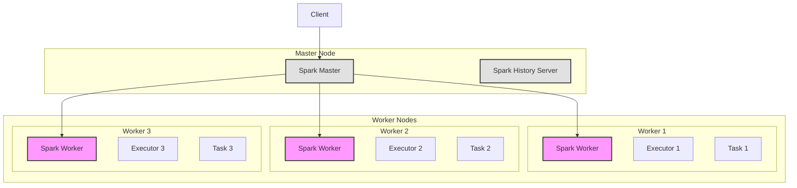

**架构说明**：
- **Master Node**：主节点，负责集群资源管理、任务调度和Spark应用管理
- **Worker Node**：工作节点，每个节点运行一个Spark Worker进程，负责启动Executor和分配计算任务
- **Executor**：运行在Worker节点上的进程，负责执行具体的计算任务
- **Task**：Executor中的最小执行单元，负责处理RDD的分区数据

## 五、实验内容

### 5.1 准备工作

启动Spark集群，进入Spark命令行界面，执行以下命令：

```
spark-shell
```

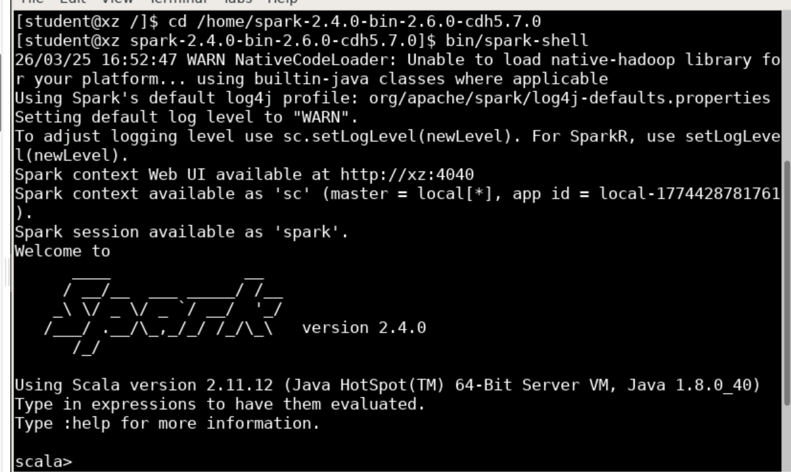

### 5.2 Spark RDD数据源

#### 5.2.1 内部数据源

内部数据源通过SparkContext的parallelize()方法将数据并行化生成RDD。首先创建列表，然后调用parallelize()方法将集合转换为RDD。

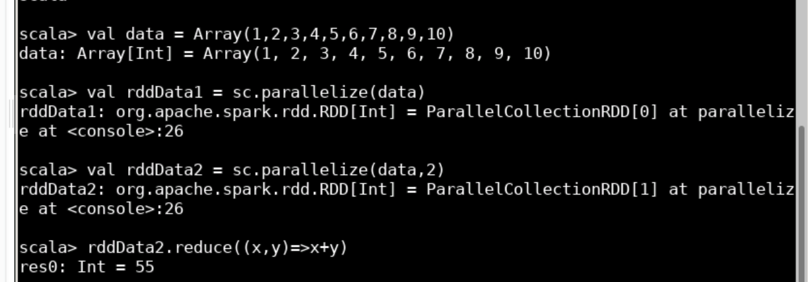

**代码示例：**
```scala
val rdd1 = sc.parallelize(List("apple","banana","orange","pear"))
rdd1.collect
```

#### 5.2.2 外部数据源

从外部读取数据创建RDD，Spark支持从任何Hadoop支持的存储上创建RDD，如本地文件系统、HDFS、HBase等。

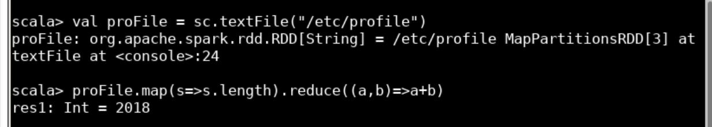

**代码示例：**
```scala
val rdd2 = sc.textFile("file:///etc/profile")
rdd2.collect
```

### 5.3 Spark RDD转化操作（Transformation）

转化操作都是惰性求值，只有执行行动操作时才会被真正计算。

#### 5.3.1 map()操作

map应用于RDD中的每一个元素，返回一个新的RDD。

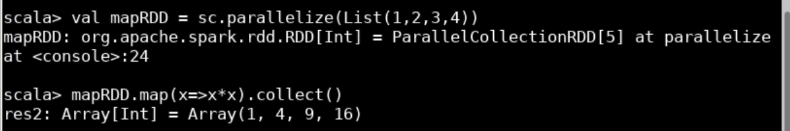

**代码示例：**
```scala
val rdd3 = rdd1.map(line => line.toUpperCase)
rdd3.collect
```

#### 5.3.2 flatMap()操作

flatMap()会对每个输入元素应用一个函数，然后返回所有输出结果，是一种一对多的映射关系。与map不同，map是一对一，flatMap是一对多。

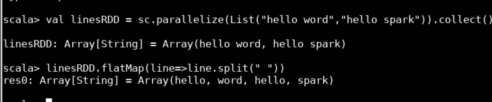

**代码示例：**
```scala
val rdd4 = rdd1.flatMap(line => line.toChars)
rdd4.collect
```

例如对于字符串"apple"，toChars会返回['a','p','p','l','e']五个字符。

#### 5.3.3 filter()操作

使用函数过滤掉不符合条件的元素。

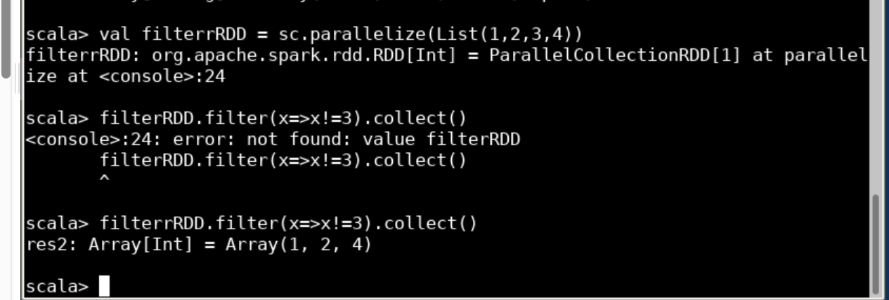

**代码示例：**
```scala
val rdd5 = rdd1.filter(line => line.toLowerCase.contains("a"))
rdd5.collect
```

#### 5.3.4 distinct()操作

把RDD中重复的元素去除。

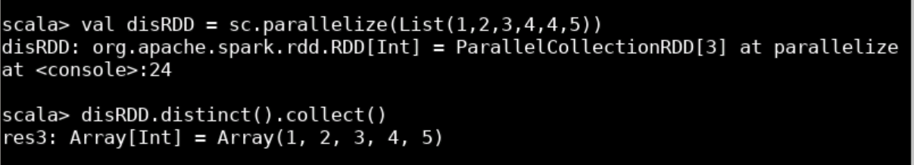

**代码示例：**
```scala
val rdd6 = rdd1.distinct
rdd6.collect
```

#### 5.3.5 union()操作

合并两个RDD的所有元素。

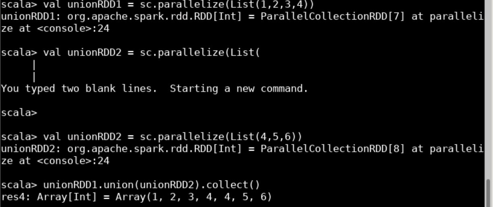

**代码示例：**
```scala
val rdd7 = rdd1.union(rdd2)
rdd7.collect
```

#### 5.3.6 intersection()操作

生成包含两个RDD共同元素的RDD（交集运算）。

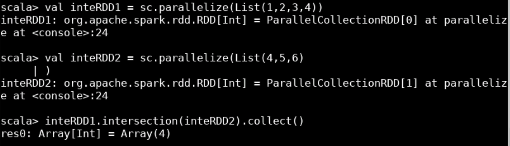

**代码示例：**
```scala
val rdd8 = rdd1.intersection(rdd2)
rdd8.collect
```

#### 5.3.7 subtract()操作

将原RDD和参与运算的RDD中相同的元素去除（差集运算）。

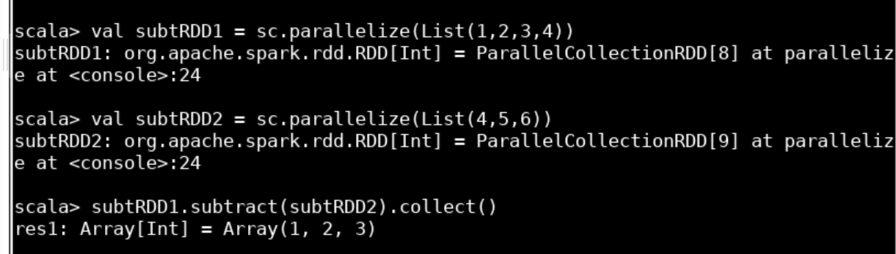

**代码示例：**
```scala
val rdd9 = rdd1.subtract(rdd2)
rdd9.collect
```

### 5.4 Spark RDD行动操作（Action）

行动操作进行实际的计算，与惰性求值的转化操作不同。

#### 5.4.1 collect()操作

输出RDD中的所有元素。

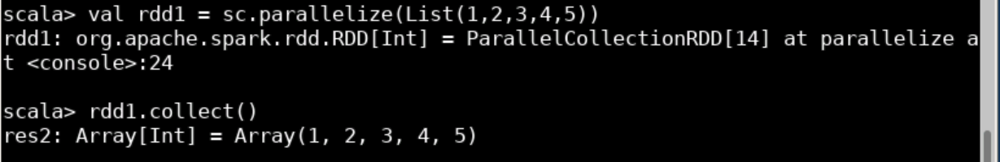

**代码示例：**
```scala
val rdd10 = sc.parallelize(List(1,2,3,4,5))
rdd10.collect
```

#### 5.4.2 count()操作

计算RDD中元素的个数。

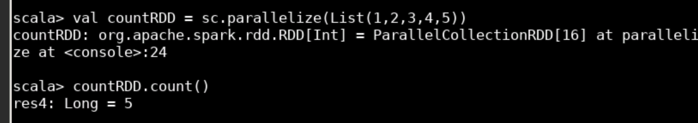

**代码示例：**
```scala
rdd10.count
```

#### 5.4.3 countByValue()操作

计算RDD中每个元素出现的次数。

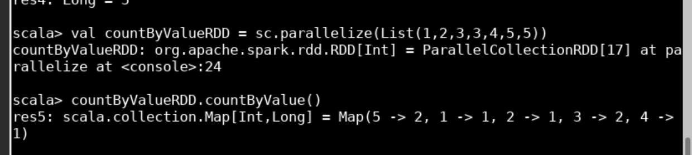

**代码示例：**
```scala
val rdd11 = sc.parallelize(List(1,1,2,2,2,3))
rdd11.countByValue
```

#### 5.4.4 take(num)操作

从RDD中输出num个元素。

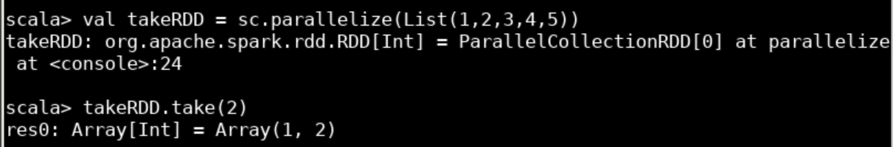

**代码示例：**
```scala
rdd10.take(3)
```

#### 5.4.5 top(num)操作

从RDD中按照默认（降序）输出最前面的num个元素。

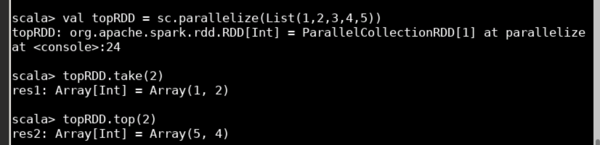

**代码示例：**
```scala
rdd10.top(3)
```

#### 5.4.6 reduce(func)操作

并行整合RDD中所有数据，将元素两两传递给输入函数求得新值。

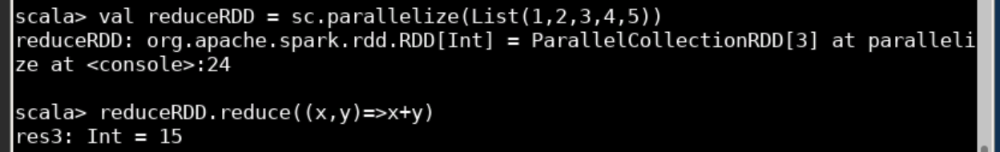

**代码示例：**
```scala
val rdd12 = sc.parallelize(List(1,2,3,4,5))
rdd12.reduce(_ + _)
```

#### 5.4.7 foreach(func)操作

对RDD中每个元素使用给定的操作。

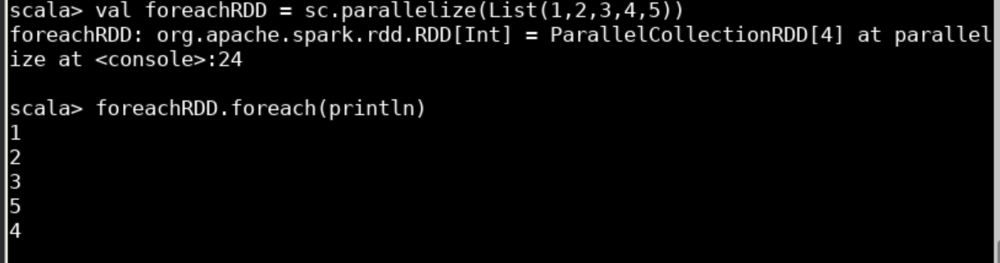

**代码示例：**
```scala
rdd10.foreach(x => println(x))
```

### 5.5 Spark RDD WordCount实例

综合运用RDD的数据源、转化、行动操作，统计本地文件/etc/profile中单词的出现次数。

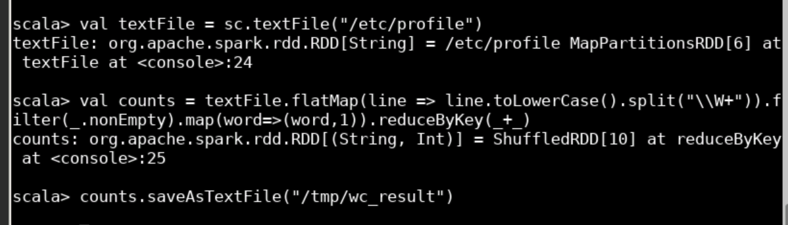

**代码示例：**
```scala
// 从本地文件系统读取文件，创建RDD
val file = sc.textFile("file:///etc/profile")

// 链式调用：分词 -> 过滤空值 -> 映射为键值对 -> 按键聚合
val counts = file
  .flatMap(line => line.toLowerCase.split("\\W+"))  // 每行分词，转小写
  .filter(word => word.nonEmpty)                     // 过滤空字符串
  .map(word => (word, 1))                            // 映射为(单词,1)
  .reduceByKey(_ + _)                                // 相同单词出现次数相加

counts.collect                                        // 触发计算，输出结果
counts.saveAsTextFile("/tmp/wc_result")              // 保存结果到指定目录
```

**代码步骤说明：**

第一步：使用SparkContext的textFile()函数从本地文件系统读取/etc/profile文件将其转化为RDD。

第二步：使用flatMap(line => line.toLowerCase().split("\\W+"))把每一行中的句子分隔开，将其转化为记录着每一个单词的RDD。

第三步：使用filter(_.nonEmpty)过滤掉元素中的空值。

第四步：使用map(word => (word,1))把记录着每一个单词的RDD转化为(word,1)这种表示每一个单词出现一次的键值对形式的RDD。

第五步：使用reduceByKey(_ + _)把具有相同键的RDD的次数进行相加，求出每个单词的词频。

第六步：使用saveAsTextFile("/tmp/wc_result")函数把结果存入/tmp/wc_result文件夹中。

### 5.6 查看结果

退出Spark-shell，进入结果目录查看输出文件。

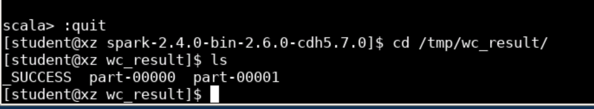

**执行命令：**

```
:quit
cd /tmp/wc_result
ls
```

使用ls指令可以看到该目录下有3个文件（part-00000、part-00001、_SUCCESS）。

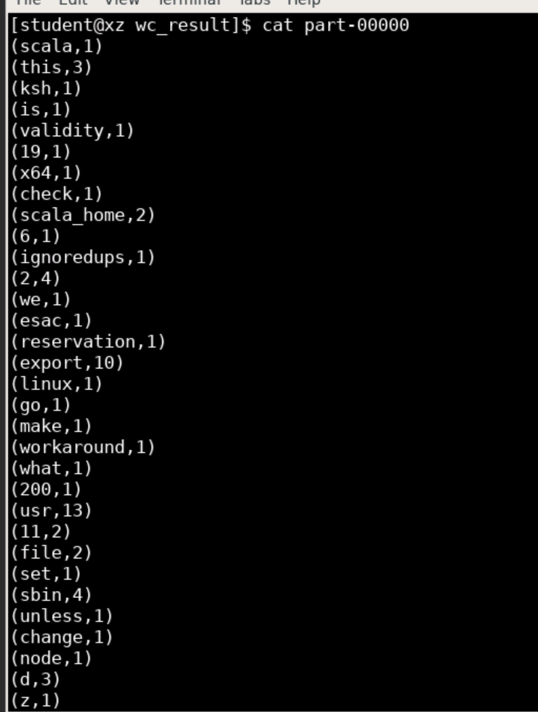

**执行命令：**

```
cat part-00000
```

可以看到WordCount统计结果，每个单词及其出现次数以键值对的形式存储。部分结果如下：

```
(usr,13)
(export,10)
(sbin,4)
(this,3)
(scala_home,2)
(file,2)
...
```

## 六、实验结果

### 6.1 实验截图

在此处添加实验过程中拍摄的截图，展示Spark Shell操作、RDD转化和行动操作的结果。


### 6.2 WordCount输出结果

```
(usr,13)
(export,10)
(sbin,4)
(this,3)
(scala_home,2)
(file,2)
...
```

## 七、实验总结

本次实验完成了以下内容：

1. 学习了RDD的两种创建方式：通过parallelize方法从内部集合创建，以及通过textFile从外部文件读取。

2. 掌握了7种转化操作：map、flatMap、filter、distinct、union、intersection、subtract。这些操作不会立即执行，只有遇到行动操作时才会真正计算。

3. 掌握了7种行动操作：collect、count、countByValue、take、top、reduce、foreach。这些操作会触发实际的计算。

4. 通过WordCount实例，将多个转化操作链式组合，配合行动操作完成词频统计任务。

实验中印象较深的是flatMap操作，它与map的区别在于一对多的映射关系，一个输入可以产生多个输出，这在分词场景中非常有用。另外，惰性求值的机制使得Spark可以优化计算流程，避免不必要的中间计算。
