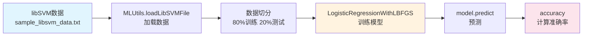

# 实验4.3 Logistic Regression（逻辑回归）

## 一、实验目的

1. 理解逻辑回归（Logistic Regression）算法的原理；
2. 掌握使用Spark MLlib实现逻辑回归分类；
3. 掌握如何加载libSVM格式数据；
4. 学会评估分类模型的准确率。

## 二、实验内容

本实验利用理论课所学知识，实现逻辑回归Logistic Regression，对libSVM格式数据进行分类。实验中需要：
- 使用spark自带的libSVM数据（spark-2.4.0/data/mllib/sample_libsvm_data.txt）
- 切分数据集，训练集（80%），测试集（20%）
- 使用LogisticRegressionWithLBFGS进行训练，分成10类
- 计算测试集上分类的准确率accuracy
- 尝试如何提升测试效果

## 三、实验原理

### 3.1 逻辑回归概述

逻辑回归是一种经典的分类算法，虽然名称中包含"回归"，但它实际上是一种分类算法，主要用于二分类或多分类问题。逻辑回归使用Sigmoid函数将线性回归的输出映射到[0,1]区间，表示样本属于正类的概率。

### 3.2 Sigmoid函数

$$g(z) = \frac{1}{1 + e^{-z}}$$

Sigmoid函数的输出值域为(0,1)，可以理解为概率值。

### 3.3 逻辑回归模型

$$h_\theta(x) = g(\theta^T x) = \frac{1}{1 + e^{-\theta^T x}}$$

其中 $\theta$ 是模型参数，$x$ 是输入特征。

### 3.4 L-BFGS优化算法

L-BFGS（Limited-memory Broyden–Fletcher–Goldfarb–Shanno）是一种拟牛顿优化算法，用于高效地求解逻辑回归模型的参数。在Spark MLlib中，`LogisticRegressionWithLBFGS`使用该算法进行模型训练。

### 3.5 逻辑拓扑图



### 3.6 libSVM数据格式

libSVM是一种常用的机器学习数据格式，格式为：
```
<label> <index1>:<value1> <index2>:<value2> ...
```

例如：
```
0 128:51 129:159 130:253 ...
1 159:124 160:253 161:255 ...
```

## 四、实验环境

### 4.1 软件环境

| 环境 | 版本 |
|------|------|
| Spark | 2.4.0 |
| Hadoop | 2.7 |
| Scala | 2.11 |
| 开发工具 | IntelliJ IDEA |

### 4.2 数据文件

数据文件位于：`spark-2.4.0/data/mllib/sample_libsvm_data.txt`

数据格式为libSVM格式，包含10个类别的样本数据。

### 4.3 实验环境截图


## 五、实验过程

### 5.1 数据加载

#### 步骤1：加载libSVM格式数据

```scala
import org.apache.spark.mllib.util.MLUtils

// 加载训练数据
val data = MLUtils.loadLibSVMFile(sc, "data/mllib/sample_libsvm_data.txt")
```

### 5.2 数据切分

#### 步骤2：切分训练集和测试集

```scala
// 切分数据集，80%训练，20%测试
val splits = data.randomSplit(Array(0.8, 0.2), seed = 11L)
val trainingData = splits(0)
val testData = splits(1)
```

### 5.3 模型训练

#### 步骤3：使用LogisticRegressionWithLBFGS训练模型

```scala
import org.apache.spark.mllib.classification.LogisticRegressionWithLBFGS

// 创建逻辑回归模型，设置为10类分类
val model = new LogisticRegressionWithLBFGS()
  .setNumClasses(10)
  .run(trainingData)
```

### 5.4 模型预测与评估

#### 步骤4：计算测试集准确率

```scala
// 对测试数据进行预测
val predictionAndLabel = testData.map { point =>
  val prediction = model.predict(point.features)
  (prediction, point.label)
}

// 计算准确率
val accuracy = predictionAndLabel.filter(r => r._1 == r._2).count.toDouble / testData.count
println(s"Accuracy = $accuracy")
```

### 5.5 运行程序

#### 步骤5：执行Spark-submit

```bash
spark-submit \
--class com.LogisticRegressionDemo \
--master local[*] \
/path/to/LogisticRegressionDemo.jar
```


## 六、实验结果

### 6.1 结果展示

程序运行后，会输出以下信息：
- 训练集的样本数量
- 测试集的样本数量
- 模型训练的迭代次数
- 测试集上的分类准确率（accuracy）

### 6.2 结果分析

1. **数据切分**：将原始数据按80%/20%的比例随机切分为训练集和测试集。

2. **模型训练**：使用L-BFGS优化算法训练逻辑回归模型，设置分类数为10类。

3. **准确率评估**：通过计算预测正确的样本数与测试集总样本数的比值，得到分类准确率。

4. **效果提升建议**：
   - 增加训练迭代次数
   - 调整学习率参数
   - 进行特征标准化/归一化
   - 增加训练数据量

### 6.3 关键结果截图


## 七、实验总结

### 7.1 收获与体会

通过本次实验，我掌握了以下技能和知识：

1. **libSVM数据格式**：
   - 理解了libSVM数据格式的结构
   - 学会了使用MLUtils.loadLibSVMFile加载数据

2. **逻辑回归算法**：
   - 理解了逻辑回归的原理和Sigmoid函数
   - 学会了使用LogisticRegressionWithLBFGS训练模型

3. **模型评估**：
   - 学会了计算分类准确率
   - 理解了如何评估分类模型性能

4. **数据处理**：
   - 掌握了Spark中数据集的切分方法
   - 学会了处理高维稀疏特征数据

### 7.2 注意事项

1. libSVM数据格式中，特征索引从1开始，而不是0。

2. 数据切分时使用相同的seed可以保证结果的可复现性。

3. L-BFGS算法适合大规模数据的训练，但对于非常大的数据集可能需要更多内存。

4. 准确率只是评估分类模型的一个指标，实际应用中还需要考虑精确率、召回率、F1值等指标。

5. 在实际应用中，可能需要对数据进行归一化或标准化处理以提高模型性能。