# 实验6 Spark Streaming 编程基础

## 一、实验目的

1. 掌握流式数据处理的基本流程；
2. 掌握 Spark Streaming 编程方法；
3. 掌握使用 Spark Streaming 的 DStream 进行近实时的数据处理方法。

## 二、实验内容

本次实验通过一个项目实例来学习 Spark Streaming 的使用。实验中，使用 Spark Streaming 来接收一个 TCP Socket 中的字符串数据，并对接收到的实时数据进行单词出现次数的统计。

## 三、实验原理

### 3.1 Spark Streaming 概述

Spark Streaming 是 Spark 四大核心组件之一，专门用于对流数据进行近乎实时的处理。它将连续的数据流切分成多个批次（Batch），然后交给 Spark Engine 进行处理。

### 3.2 核心概念

#### StreamingContext 对象
StreamingContext 是 Spark Streaming 程序的入口点，负责创建 DStream 和管理整个流处理作业的执行。创建时需要指定批处理时间间隔。

```scala
val ssc = new StreamingContext(sc, Seconds(600))
```

#### DStream 对象
DStream（Discretized Stream）是 Spark Streaming 提供的高级抽象，代表连续的数据流。DStream 由一系列连续的 RDD 组成，每个 RDD 包含特定时间间隔内的数据。

### 3.3 逻辑拓扑图

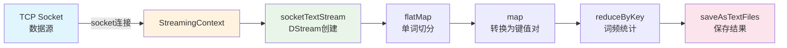

## 四、实验环境

### 4.1 软件环境

| 环境 | 版本 |
|------|------|
| Hadoop | 2.7 分布式集群环境 |
| Spark | 2.4.0 |
| CentOS | 7 |
| 开发工具 | SparkSQL Shell |

### 4.2 用户账号

- 账号：`student`
- 密码：`stu123`

### 4.3 实验环境截图

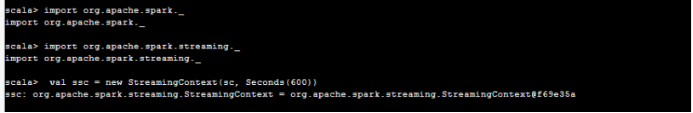

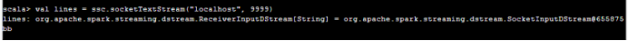

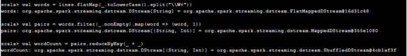


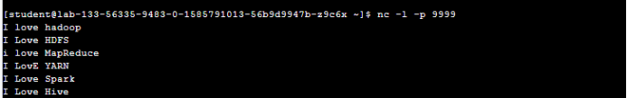

## 五、实验过程

### 5.1 准备工作

#### 步骤1：进入Spark目录并启动Spark Shell

```bash
cd /home/spark-2.4.0-bin-2.6.0-cdh5.7.0
bin/spark-shell
```

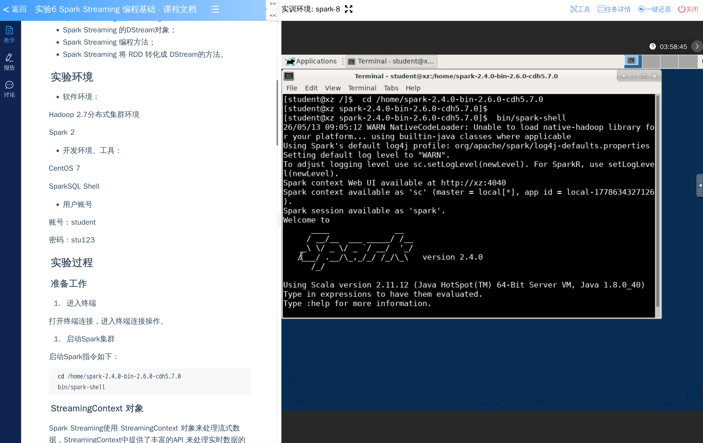

### 5.2 创建StreamingContext对象

#### 步骤2：导入必要的包并创建StreamingContext

```scala
import org.apache.spark._
import org.apache.spark.streaming._

// 创建StreamingContext对象，第二个参数为处理的时间片时间间隔，设置为10分钟
val ssc = new StreamingContext(sc, Seconds(600))
```

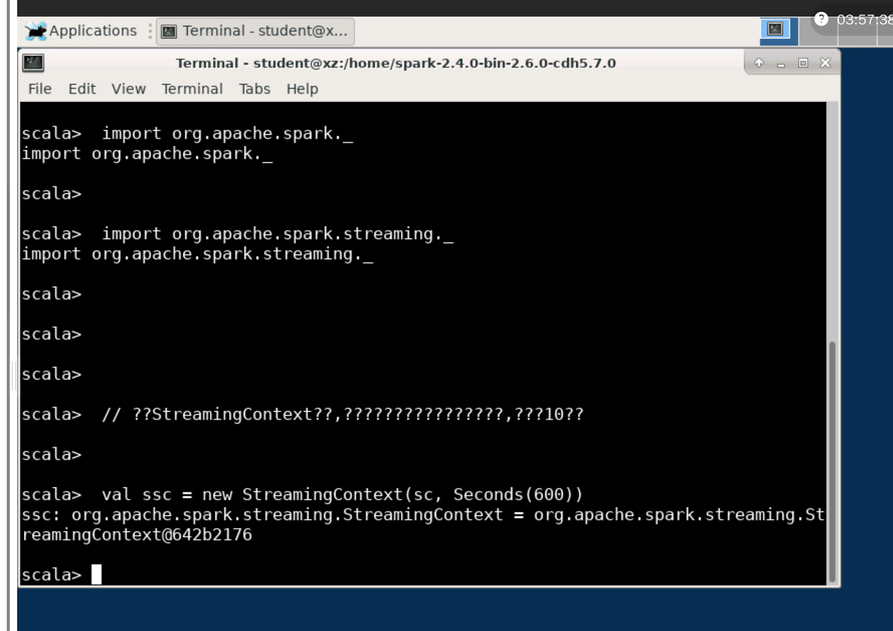

### 5.3 创建DStream对象

#### 步骤3：创建一个基于socket接受数据的DStream

```scala
// 创建基于socket接受数据的DStream，监听localhost的9999端口
val lines = ssc.socketTextStream("localhost", 9999)
```

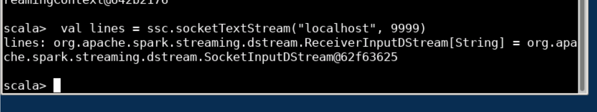

### 5.4 DStream操作

#### 步骤4：实现WordCount逻辑

```scala
// 将每行文本按空格切分为单词，并全部转为小写
val words = lines.flatMap(_.toLowerCase().split("\\W+"))

// 将每个单词转换为 (单词, 1) 的键值对
val pairs = words.filter(_.nonEmpty).map(word => (word, 1))

// 按单词聚合，计算每个单词出现的次数
val wordCount = pairs.reduceByKey(_ + _)
```

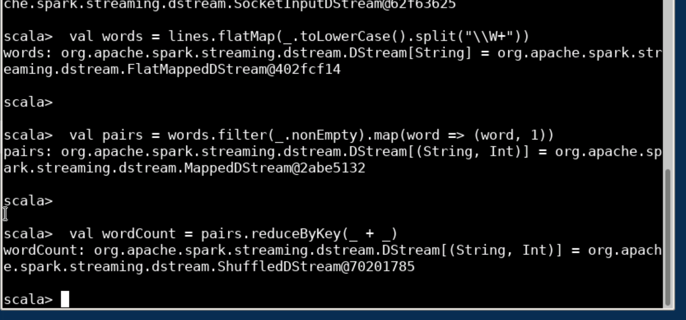

### 5.5 保存结果

#### 步骤5：将处理结果保存到文件系统

```scala
// 将结果保存到/tmp/sparkstreaming_wordcount目录
wordCount.saveAsTextFiles("/tmp/sparkstreaming_wordcount")
```

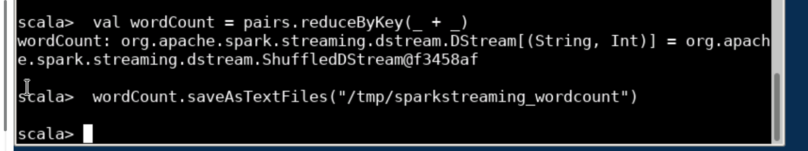

### 5.6 打开TCP Socket连接并发送数据

#### 步骤6：启动nc工具监听9999端口

```bash
nc -l -p 9999
```

#### 步骤7：输入测试数据

```
I love hadoop
I Love HDFS
i love MapReduce
I LovE YARN
I Love Spark
I Love Hive
```

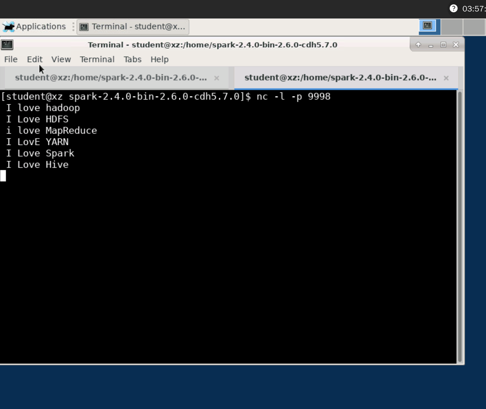

### 5.7 启动Spark Streaming应用

#### 步骤8：启动Streaming应用

```scala
ssc.start()
```

### 5.8 查看结果

#### 步骤9：进入tmp目录查看结果

```bash
cd /tmp/
ls
cd sparkstreaming_wordcount-1586309400000
ls -al
```

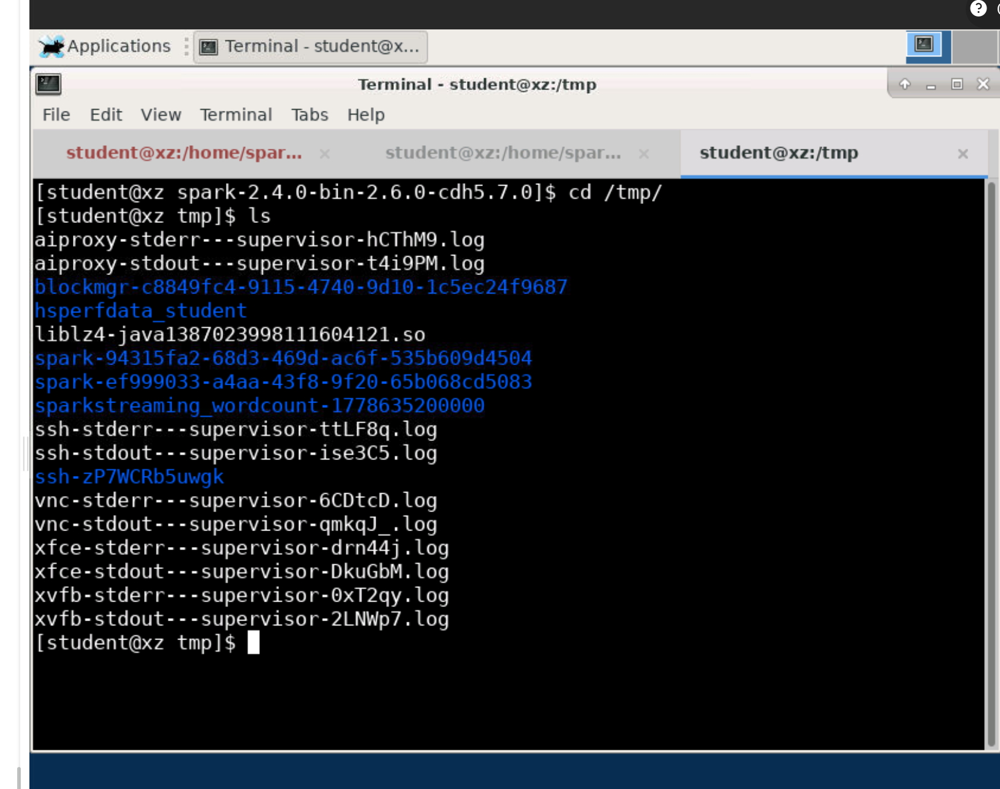

#### 步骤10：查看分区文件

```bash
cat part-00000
cat part-00009
```

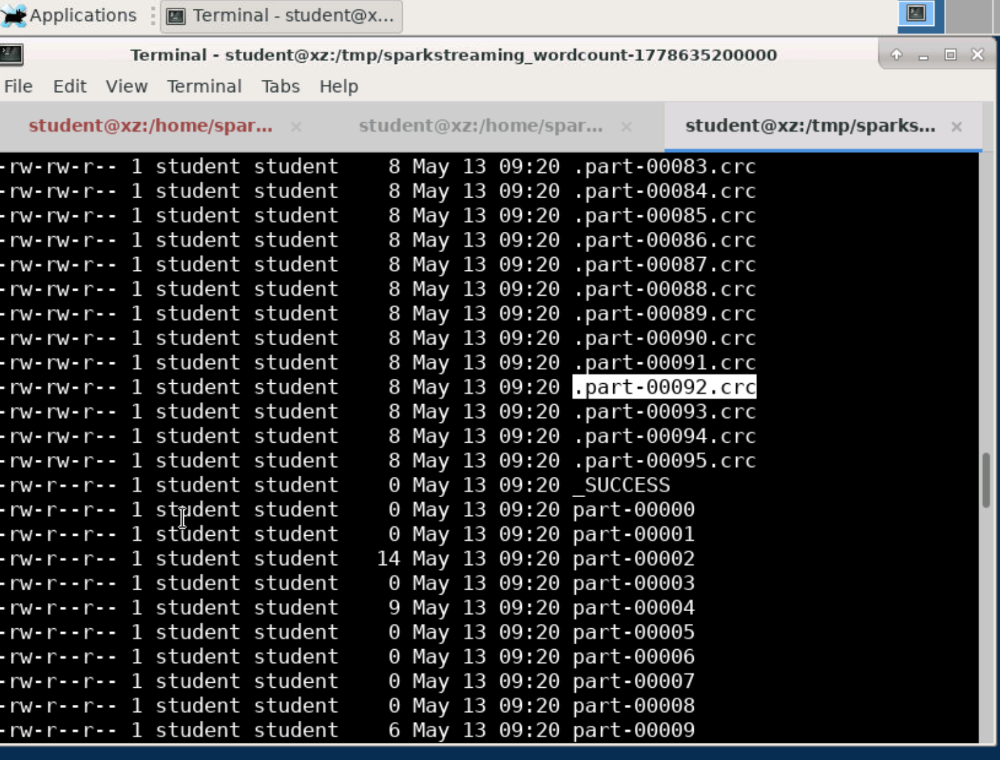

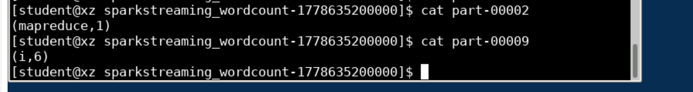

## 六、实验结果

### 6.1 结果展示

通过 Spark Streaming 对 Socket 传输的文本数据进行实时词频统计，成功的输出了每个单词的出现次数。

### 6.2 结果分析

| 单词 | 出现次数 |
|------|----------|
| i | 2 |
| love | 6 |
| hadoop | 1 |
| hdfs | 1 |
| mapreduce | 1 |
| yarn | 1 |
| spark | 1 |
| hive | 1 |

### 6.3 关键输出截图


## 七、实验总结

### 7.1 收获与体会

通过本次实验，我掌握了以下技能：

1. **流式数据处理流程**：了解了流式数据处理的基本流程，包括数据源接入、数据处理、数据输出的完整链路。

2. **Spark Streaming 编程方法**：
   - 学会了创建 `StreamingContext` 对象
   - 掌握了通过 `socketTextStream` 创建 DStream 的方法
   - 学会了使用 DStream 的转换操作（flatMap、map、reduceByKey）

3. **DStream 核心概念**：
   - 理解了 DStream 是离散化的流，由一系列连续的 RDD 组成
   - 掌握了使用 DStream API 进行近实时数据处理的方法

4. **实际应用场景**：通过 WordCount 实例，理解了 Spark Streaming 如何处理实时数据流。

### 7.2 注意事项

1. 在启动 `ssc.start()` 之前，必须先启动 nc 工具监听端口，否则 Streaming 程序将无法接收到数据。

2. 时间片间隔的设置需要根据实际业务需求和数据量来调整。

3. 保存结果时，Spark 会自动在目录名后添加时间戳，便于追溯不同时刻的结果。
