# 实验9 Spark MLlib 应用：聚类K-means算法评估足球比赛

## 一、实验目的

1. 掌握Spark API的基本使用；
2. 掌握Normalizer正则化；
3. 掌握MLlib Kmeans聚类。

## 二、实验内容

聚类属于无监督学习，相比于分类，聚类不依赖预定义的类和类标号的训练实例。本实验介绍一种常见的聚类算法——K均值（K-means）聚类，实验内容是：应用聚类方法试图解决一个在体育界的问题——中国男子足球队近几年在亚洲到底处于几流水平。

实验中使用的数据包括了亚洲15支男子足球队的2005年到2010年的世界级大赛的成绩，然后使用K-Means算法对球队进行聚类，将球队分为若干个级别（例如：将球队分为3个等级），分析中国男子足球队属于哪一个等级。

## 三、实验原理

### 3.1 K-means算法概述

K-means算法是一种经典的聚类算法，其核心思想是：将数据集中的所有样本划分到K个簇（Cluster）中，每个样本到其所属簇的中心点的距离平方和最小。

### 3.2 K-means算法步骤

1. **初始化**：随机选取K个样本作为初始聚类中心；
2. **分配**：对每个样本，计算其到K个聚类中心的距离，将其分配到距离最近的簇；
3. **更新**：重新计算每个簇的中心点；
4. **迭代**：重复步骤2和3，直到聚类中心不再变化或达到最大迭代次数。

### 3.3 逻辑拓扑图

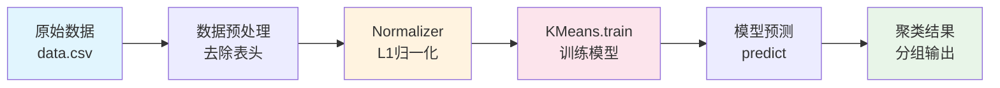

### 3.4 Spark MLlib简介

Spark机器学习库提供了常用机器学习算法的实现，包括聚类、分类、回归、协同过滤、维度缩减等。Spark机器学习库从1.2版本以后被分为两个包：
- `spark.ml`：提供DataFrame风格的API
- `spark.mllib`：提供RDD风格的API

## 四、实验环境

### 4.1 软件环境

| 环境 | 版本 |
|------|------|
| Hadoop | 2.7分布式集群环境 |
| Spark | 2.4.0 |
| Spark MLlib | 2.3.3 |
| CentOS | 7 |
| 开发工具 | IntelliJ IDEA |

### 4.2 用户账号

- 账号：`student`
- 密码：`stu123`

### 4.3 项目依赖

```xml
<dependencies>
    <dependency>
        <groupId>org.apache.spark</groupId>
        <artifactId>spark-core_2.11</artifactId>
        <version>2.3.3</version>
    </dependency>
    <dependency>
        <groupId>org.apache.spark</groupId>
        <artifactId>spark-mllib_2.11</artifactId>
        <version>2.3.3</version>
    </dependency>
</dependencies>
```

### 4.4 实验环境截图

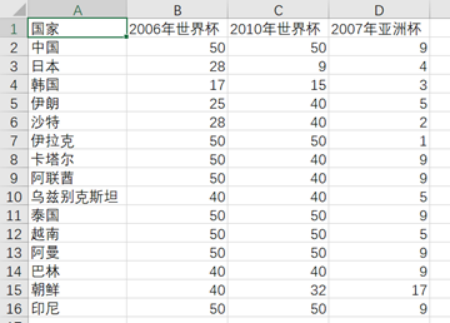

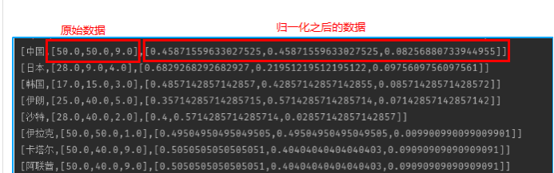


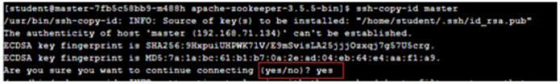

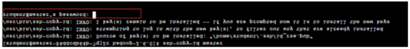

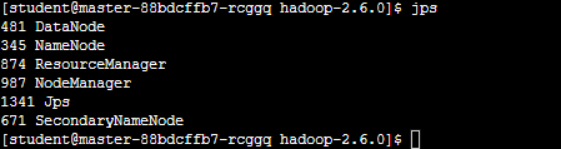

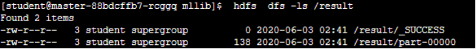

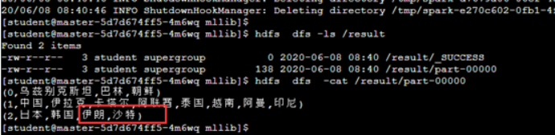

## 五、实验过程

### 5.1 环境准备

#### 步骤1：修改hosts文件

```bash
sudo vi /etc/hosts
```

#### 步骤2：配置免密连接

```bash
ssh-keygen -t rsa
ssh-copy-id student@master
```

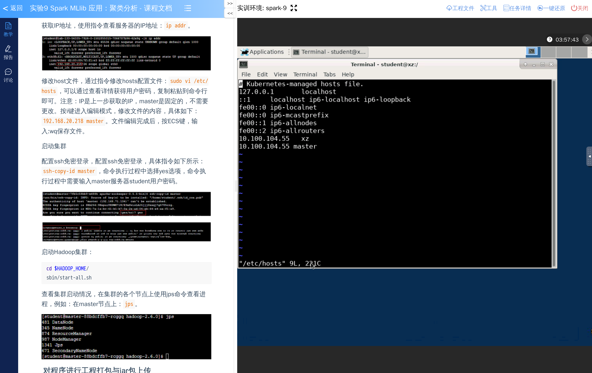

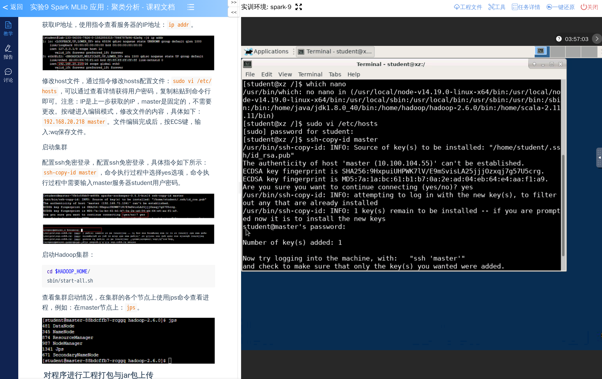

### 5.2 启动Hadoop集群

#### 步骤3：启动全部进程

```bash
cd $HADOOP_HOME/
sbin/start-all.sh
```

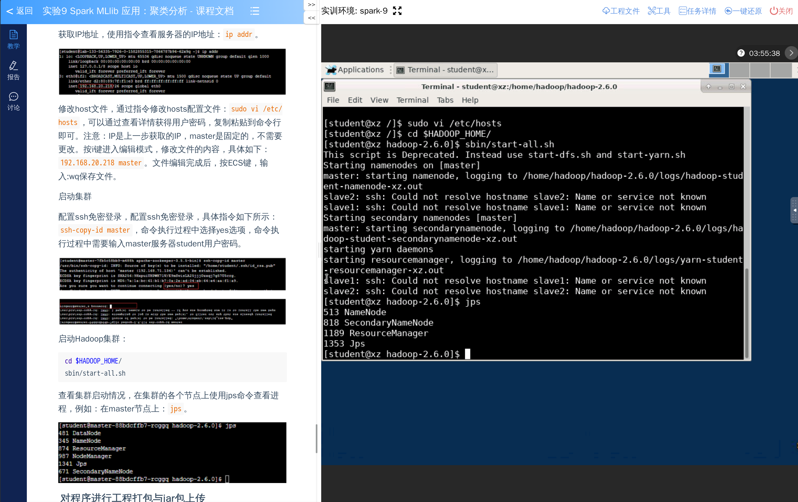

### 5.3 数据准备

#### 步骤4：上传数据文件到HDFS

```bash
cd /home/spark-2.4.0-bin-2.6.0-cdh5.7.0/data/mllib
hdfs dfs -put data.csv hdfs://master:8020/
```

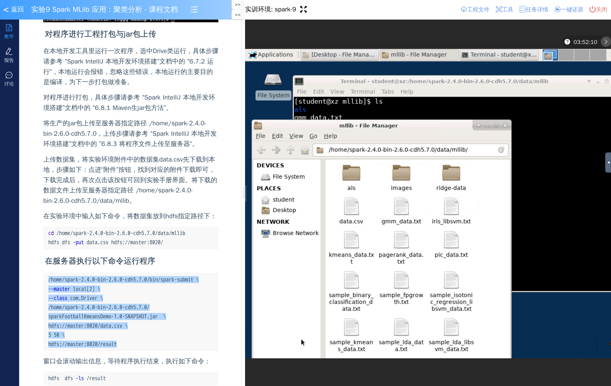

### 5.4 程序实现

#### 步骤5：数据归一化

```scala
package com

import org.apache.spark.ml.feature.Normalizer
import org.apache.spark.ml.linalg.Vectors
import org.apache.spark.sql.{DataFrame, SparkSession}

object FootballNormalization {
  def parseData(ds:RDD[String], sparkSession: SparkSession): DataFrame = {
    val data = ds.map { line =>
      val array = line.split(",")
      val id = array(0)
      (id, Vectors.dense(array.drop(1).map(_.toDouble)))
    }
    val dataFrame = sparkSession.createDataFrame(data).toDF("id", "features")
    
    val normalizer = new Normalizer()
      .setInputCol("features")
      .setOutputCol("normFeatures")
      .setP(1.0)
    
    val l1NormData = normalizer.transform(dataFrame)
    println("Normalized using L^1 norm")
    l1NormData
  }
}
```

#### 步骤6：K-means聚类

```scala
package com

import org.apache.spark.mllib.clustering.{KMeans, KMeansModel}
import org.apache.spark.mllib.linalg.Vector
import org.apache.spark.rdd.RDD

object FootballCluster {
  def trainModel(parsedData: RDD[Vector], k: Int, maxIterations: Int): KMeansModel = {
    val scaled_data = parsedData.randomSplit(Array(0.8, 0.2), 12L)
    val data_train = parsedData
    val data_test = scaled_data(1)
    
    val kmeansModel = KMeans.train(data_train, k, maxIterations)
    val clusterCenters = kmeansModel.clusterCenters
    clusterCenters.foreach(u => println(u))
    kmeansModel
  }
}
```

#### 步骤7：主程序

```scala
package com

import org.apache.spark.ml.feature.Normalizer
import org.apache.spark.ml.linalg.Vector
import org.apache.spark.ml.linalg.Vectors.fromML
import org.apache.spark.sql.{SparkSession}
import org.apache.spark.{SparkConf, SparkContext}

object Driver {
  def main(args: Array[String]): Unit = {
    val conf = new SparkConf().setMaster("local[3]").setAppName("football cluster")
    val sparkSession = SparkSession.builder()
      .master("local[3]")
      .appName("football cluster")
      .config(conf)
      .getOrCreate()
    
    var ds = sparkSession.sparkContext.textFile(args(0), 1)
    val header = ds.first()
    ds = ds.filter(row => row != header)
    
    val l1NormData = FootballNormalization.parseData(ds, sparkSession)
    l1NormData.cache()
    
    val data1 = l1NormData.rdd.map { r =>
      fromML(r.getAs[Vector]("features").toDense)
    }
    
    val kmeansModel = FootballCluster.trainModel(data1, args(1).toInt, args(2).toInt)
    
    val data2 = l1NormData.rdd.map { r =>
      (r.getAs[String]("id"), fromML(r.getAs[Vector]("features").toDense))
    }
    
    val result = data2.map { line =>
      val id = line._1
      val label = kmeansModel.predict(line._2)
      (label, id)
    }.reduceByKey((v1, v2) => v1 + "," + v2)
    
    result.collect().foreach(println(_))
    result.saveAsTextFile(args(3))
  }
}
```

### 5.5 运行程序

#### 步骤8：执行spark-submit

```bash
/home/spark-2.4.0-bin-2.6.0-cdh5.7.0/bin/spark-submit \
--master local[2] \
--class com.Driver \
/home/spark-2.4.0-bin-2.6.0-cdh5.7.0/sparkFootballKmeansDemo-1.0-SNAPSHOT.jar \
file:///home/spark-2.4.0-bin-2.6.0-cdh5.7.0/data/mllib/data.csv \
3 50 \
file:///home/spark-2.4.0-bin-2.6.0-cdh5.7.0/data/mllib/result
```

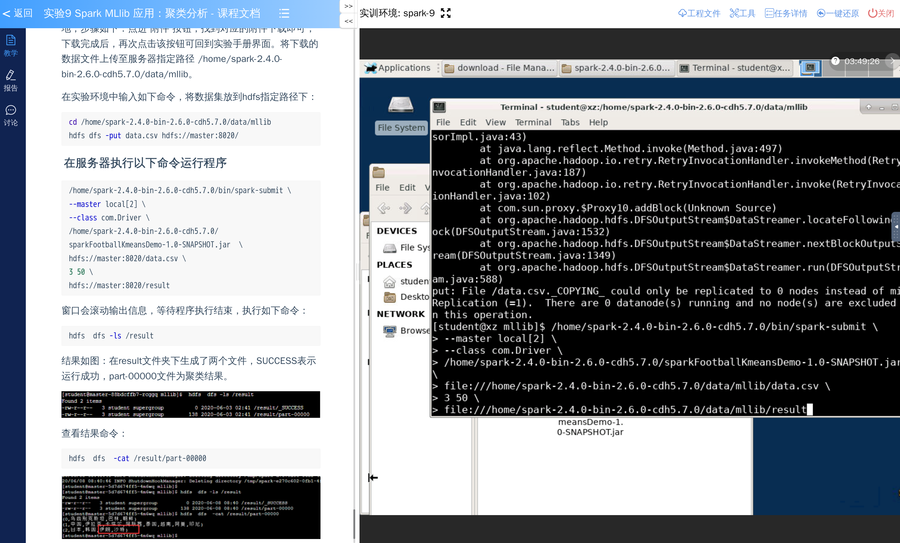

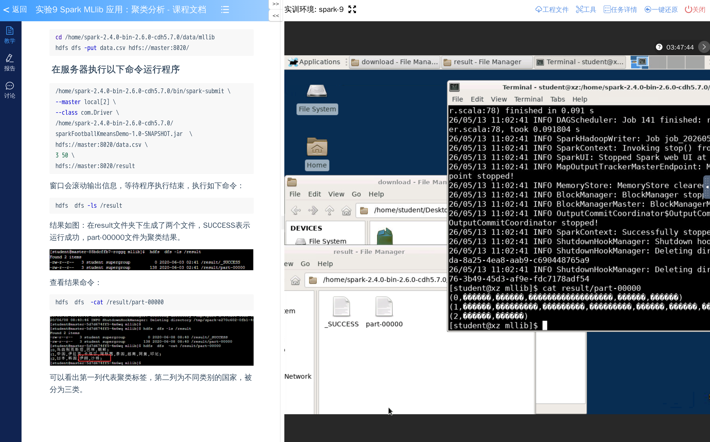

## 六、实验结果

### 6.1 结果展示

通过K-means聚类算法，将15支亚洲男子足球队分为3个等级。聚类结果会根据球队的比赛成绩数据，将特点相似的球队归为同一簇。

### 6.2 结果分析

1. **数据归一化**：使用L1范数（曼哈顿距离）对原始数据进行归一化处理，确保不同量纲的特征具有相同的权重。

2. **K值选择**：实验中将K设置为3，即将球队分为3个等级（一流、二流、三流）。

3. **迭代次数**：设置最大迭代次数为50次，确保算法能够收敛到较优解。

4. **聚类中心**：每个簇的中心点代表了该等级球队的整体水平特征。

### 6.3 关键结果截图


## 七、实验总结

### 7.1 收获与体会

通过本次实验，我掌握了以下技能和知识：

1. **Spark API使用**：
   - 学会了创建SparkConf和SparkSession配置Spark应用
   - 掌握了使用DataFrame和RDD处理数据的方法

2. **Normalizer正则化**：
   - 理解了L1范数归一化的原理和作用
   - 学会了使用MLlib的Normalizer进行数据预处理

3. **K-means聚类**：
   - 理解了K-means算法的核心思想和工作流程
   - 学会了使用Spark MLlib的KMeans.train方法训练模型
   - 掌握了模型预测和结果评估的方法

4. **实际应用**：
   - 通过体育数据分析的实例，展示了机器学习在体育领域的应用
   - 理解了如何将无监督学习应用于实际问题

### 7.2 注意事项

1. 在运行Spark程序前，需要确保Hadoop集群已正常启动。

2. 数据文件路径可以使用本地路径（file://）或HDFS路径（hdfs://），根据实际部署环境选择。

3. K-means算法需要预先指定聚类个数K，K值的选择会影响聚类结果。

4. 在进行聚类分析前，对数据进行归一化处理可以提高聚类效果的准确性。

5. 迭代次数的设置需要根据数据规模和收敛情况调整，过多迭代会增加计算时间。
